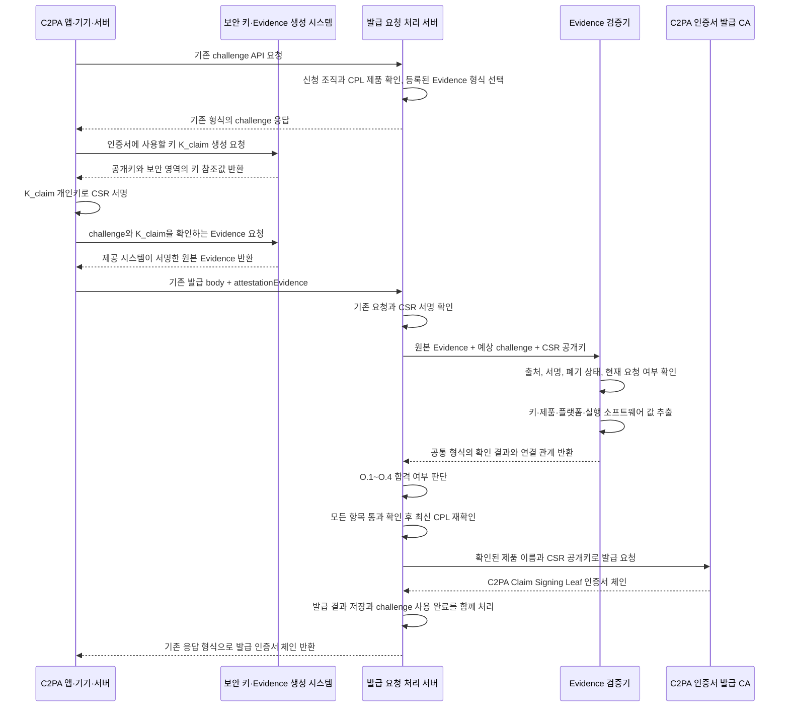

# C2PA AL2 검증 증거를 이용한 인증서 발급 명세

## 1. 목적과 범위

이 문서는 이미 운영 중인 C2PA AL1 인증서 발급 API와 새 요청 확인값 발급 API에 AL2 검증을 추가하는 방법을 정의한다. 여기서 발급하는 인증서는 C2PA Manifest 서명용 최종 인증서(Claim Signing Leaf)다.

주요 범위는 다음과 같다.

- 인증서 발급 요청서(PKCS#10 CSR) 생성 및 검증
- 신뢰할 수 있는 제공 시스템이 서명한 검증 증거(Attestation Evidence)의 전송 형식
- 기존 새 요청 확인값(challenge)을 검증 증거에 넣고 재사용 공격을 막는 방법
- 검증 증거의 서명, 최신성, 발급 대상 키 및 실제 제품 연결 확인
- C2PA AL2 O.1~O.4 판정
- 최종 C2PA Claim 서명 인증서(Claim Signing Leaf) 생성
- 기존 C2PA 발급 request body에 추가되는 `attestationEvidence` 필드
- 실패 사유 코드와 감사 기록

다음 항목은 이 문서의 범위 밖이다.

- 특정 제조사 또는 플랫폼이 검증 증거를 만드는 내부 구현
- C2PA 발급 CA(Claim Signing Issuing CA) 인증서 형식
- TSA 최종 인증서와 TSA 발급 CA의 인증서 발급 절차
- Manifest 내부의 `c2pa.attestation` assertion
- 기존 AL1 API 주소, 호출자 인증, challenge 응답, CSR 전송 필드, 성공 응답 및 처리 상태의 재정의

이 문서의 `필수`, `사용 금지`, `권장`, `선택`은 구현 시 지켜야 하는 강도를 나타낸다. 요구사항 표의 `Source`는 해당 규칙의 출처다.

| Source | 의미 |
|---|---|
| `C2PA` | C2PA Certificate Policy 또는 C2PA 인증서/CSR 형식의 공식 요구사항 |
| `RFC` | PKCS#10, X.509, RATS 또는 EAT 표준 요구사항 |
| `Existing API` | 이미 구현된 AL1/challenge API의 계약을 그대로 재사용하는 부분 |
| `Local AL2` | 이 프로젝트가 구현 간 호환성과 보안을 위해 추가한 AL2 규칙 |

### 1.1 구현할 때 이 내용을 전부 알아야 하는가

한 사람이 문서 전체를 모두 알아야 하는 것은 아니다. 시스템 전체로는 모든 항목이 필요하지만, 담당 역할에 따라 읽어야 하는 범위가 다르다.

| 담당자 | 반드시 알아야 하는 내용 | 필요할 때만 보는 내용 |
|---|---|---|
| 앱·단말 개발자 | challenge value 사용법, `K_claim` 생성, CSR 생성, `attestationEvidence` 전송 | CA 내부 정책, 인증서 extension 세부값 |
| 보안 영역·Evidence 생성부 개발자 | challenge와 `K_claim`을 Evidence에 넣는 방법, 서명 범위, 제조사별 Evidence 형식 | 최종 인증서 발급 transaction |
| CA API·백엔드 개발자 | 기존 API 확장, 요청 연결, 중복 발급 방지, 발급 전 CPL 재확인 | 하드웨어 내부의 측정 구현 |
| Evidence 검증기 개발자 | Evidence 서명/인증서 체인, challenge, 키·제품·플랫폼 상태 검증 | 클라이언트 UI와 최종 인증서 저장 방식 |
| PKI·CA 개발자 | CSR 검증, 최종 Claim Signing Leaf 형식, 발급·감사·폐기 확인 | 제조사 Evidence 생성 코드 |
| 기획·아키텍처 검토자 | 1~4장과 9장의 전체 흐름 | OID, DER, COSE/EAT의 바이트 단위 세부사항 |

이미 AL1과 challenge API가 구현돼 있다면 앱·단말 개발자가 새로 구현할 핵심은 다음 네 가지다.

1. AL2 조건에 맞는 `K_claim`을 안전한 키 저장소에서 생성한다.
2. 기존 challenge value를 하드웨어 검증 증거 생성부에 전달한다.
3. `K_claim` 공개키가 포함된 CSR과, 같은 키를 증명하는 Evidence를 만든다.
4. 기존 인증서 발급 요청 body에 `attestationEvidence`를 추가한다.

### 1.2 이 문서에서 쓰는 용어

| 쉬운 표현 | 공식 용어 | 뜻 |
|---|---|---|
| 인증서 신청 조직 | Subscriber | CA와 계약하고 C2PA 인증서를 발급받는 회사 또는 조직 |
| 인증서를 요청하는 실제 앱·기기·서버 | Generator Product instance | C2PA 기능이 실제로 설치되어 실행되는 제품 하나 |
| C2PA 제품 목록 | CPL(Conforming Products List) | C2PA 적합성 확인을 통과한 제품, 신청 조직, 허용 AL과 Evidence 방식을 기록한 공식 목록 |
| C2PA 서명 정보 생성 소프트웨어 | Claim Generator | 콘텐츠의 출처·편집 이력을 담은 C2PA Claim을 만들고 `K_claim`으로 서명하는 소프트웨어 |
| 콘텐츠 처리 구성요소 | GP TOE component | C2PA Claim이나 디지털 콘텐츠를 읽고 만들고 수정하는 보안 검증 대상 소프트웨어 |
| 발급 대상 서명키 | `K_claim` | CSR과 최종 인증서에 들어가며 이후 C2PA Claim을 서명하는 키 쌍 |
| 검증 증거 | Attestation Evidence, Evidence | 키와 실행 환경 상태를 하드웨어 신뢰 기반으로 증명하는 서명 데이터 |
| Evidence 생성·서명 시스템 | Attestation Provider, Attester | 하드웨어나 보안 서비스에서 Evidence를 만드는 주체 |
| Evidence 검증기 | Verifier | Evidence의 서명과 내부 값을 확인하는 CA 측 구성요소 |
| Evidence 형식 정의 | provider profile | Evidence 구조, 서명키, challenge 위치와 검증 규칙을 정한 문서·설정 |
| 새 요청 확인값 | challenge, nonce | 이전 Evidence 재사용을 막기 위해 CA가 매 요청마다 새로 만드는 예측 불가능한 값 |
| 서로 같은 대상을 가리키는지 확인 | binding | challenge·키·제품·요청이 서로 올바르게 연결됐는지 확인하는 것 |
| 최신 요청에서 만든 증거인지 확인 | freshness | Evidence 안의 challenge가 현재 요청의 값인지 확인하는 것 |
| 신뢰 기준 인증서·키 | trust anchor | Evidence 서명자를 신뢰할 수 있는지 확인할 때 출발점으로 쓰는 CA 보관 키·인증서 |
| 기준값 | Reference Value | 허용된 앱 버전, 측정값, patch 수준처럼 Evidence와 비교하는 서버 기준 |
| 제조사·운영자 보증자료 | Endorsement | Evidence 서명키나 장치 특성을 신뢰할 수 있다고 보증하는 서명 자료 |
| 폐기 여부 확인 | revocation/status check | 분실·침해 등으로 더 이상 믿으면 안 되는 키나 인증서인지 확인하는 것 |
| 확인할 수 없으면 발급하지 않음 | fail-closed | 검증 서비스 장애나 `UNKNOWN` 결과를 성공으로 간주하지 않는 원칙 |
| 재시도 중복 방지 | idempotency | 같은 요청을 다시 보내도 인증서를 한 번만 발급하는 성질 |
| 해시값 | digest | 데이터가 같은지 비교하고 기록하기 위해 계산한 고정 길이 요약값 |
| 공개키 표준 인코딩 | SPKI | 알고리즘 정보와 공개키를 함께 담는 X.509 표준 구조 |
| 인증서 주체 이름 | Subject DN | 인증서를 사용할 제품과 조직을 C/O/CN/OU 값으로 나타낸 이름 |
| 인증서의 허용 용도 | EKU(Extended Key Usage) | 해당 인증서 키를 C2PA Claim 서명 등 어떤 목적으로 쓸 수 있는지 나타내는 확장 필드 |
| 신뢰 기반 구성요소 | TCB(Trusted Computing Base) | 보안 판단의 기반이 되는 부트로더, 펌웨어, 운영체제 핵심부 등의 집합 |

## 2. 기준 문서와 우선순위

구현 기준의 우선순위는 다음과 같다.

1. C2PA Certificate Policy와 인증서 형식 schema
2. PKCS#10 및 X.509 표준
3. CA 운영정책(CPS)과 등록된 Evidence 형식 정의(provider profile)
4. 기존 AL1/challenge API 계약
5. 이 문서의 `attestationEvidence` 증분 규칙

주요 기준은 다음과 같다.

- C2PA Certificate Policy v0.2
- C2PA Claim Signing Leaf AL2 CSR schema
- C2PA Claim Signing Leaf AL2 certificate schema
- RFC 2986 PKCS#10
- RFC 5280 X.509 PKI Certificate and CRL Profile

C2PA는 모든 플랫폼이 함께 쓰는 단일 Evidence 전송 형식을 정의하지 않는다. 따라서 CA는 허용할 Evidence 형식마다 구조, 서명 확인 방법과 O.1~O.4 판정 방법을 운영정책이나 별도 정책 설정으로 관리해야 한다.

이 문서만으로 공통 요청 구조, CA 검증 흐름, CSR·인증서 형식과 정책 판정 구조를 구현할 수 있다. 실제 Evidence 생성부와 검증기를 구현하려면 사용할 플랫폼의 Evidence 형식 정의를 최소 하나 확정해야 한다. 이 정의에는 서명되는 데이터 구조, 데이터 종류(media type), Evidence 서명 확인키를 찾는 방법, 신뢰 기준 인증서, challenge와 발급 대상 공개키의 위치, 서버 기준값, 폐기 확인 방법과 시험 데이터가 들어가야 한다.

## 3. 발급 과정의 데이터와 확인 책임

### 3.1 enrollment의 의미

`enrollment`는 **실제 앱·기기·서버가 CA에 C2PA Claim 서명 인증서를 요청하고, CA가 확인 후 발급하는 한 번의 작업**을 뜻한다. 이하에서는 `인증서 발급 작업`이라고 쓴다.

이는 C2PA 인증서에 들어가는 필드나 C2PA가 표준화한 JSON 객체 이름이 아니다. 이 문서에서는 다음 두 가지 의미로 사용한다.

| 사용 위치 | 의미 |
|---|---|
| 클라이언트 요청 | 기존 발급 API에 보내는 한 번의 인증서 발급 요청 |
| CA 내부 기록 | challenge, CSR, Evidence, 확인 결과와 발급 결과를 하나로 연결하는 서버 내부 기록 |

기존 API가 `requestId`, `certificateRequestId`, `orderId` 같은 다른 이름을 사용하면 그 이름을 그대로 유지한다. 이 문서의 `enrollmentId`는 해당 기존 식별자를 설명하기 위한 예시 이름이다.

```text
새 challenge 생성
    -> CSR과 검증 증거 제출
    -> 신청 조직, CSR, Evidence, O.1~O.4 확인
    -> C2PA Claim 서명 인증서 발급
    -> challenge를 사용 완료로 표시하고 발급 결과 저장
```

#### 3.1.1 클라이언트 요청에서 보이는 필드

실제 필드 이름과 인코딩 방식은 기존 AL1/challenge API 계약을 따른다.

| 개념 필드 | 의미 |
|---|---|
| `enrollmentId` | 현재 인증서 발급 작업을 찾는 서버 발급 ID. 기존 API의 request/order ID에 해당한다. |
| `challengeId` | CA가 발급한 challenge 기록을 찾는 ID. Evidence에 서명되는 실제 값은 아니다. |
| challenge value | Evidence에 넣어 서명해야 하는 예측 불가능한 원문 값. 보통 기존 challenge API 응답으로 받는다. |
| `csr` | 발급 대상 공개키, 인증서 이름과 요청 확장 필드를 담고 해당 개인키로 서명한 PKCS#10 인증서 발급 요청서 |
| `attestationEvidence` | AL2 요청에 추가하는 원본 검증 증거 묶음. 발급 대상 키와 앱·기기·서버 상태를 증명한다. |

`challengeId`와 challenge value는 다르다. `challengeId`는 서버 기록을 찾는 ID다. Evidence에 실제로 넣어 서명하는 값은 challenge value를 등록된 Evidence 형식에 맞게 변환한 예상 nonce다.

#### 3.1.2 CA 내부 발급 기록의 필드

아래는 논리적인 내부 모델이다. 하나의 데이터베이스 표에 모두 저장하라는 뜻은 아니다. 여러 표나 서비스로 나누더라도 값 사이의 연결 관계가 바뀌지 않도록 보장해야 한다.

| 내부 필드 | 의미 |
|---|---|
| `enrollmentId` | 발급 작업의 고유 식별자 |
| `subscriberId` | 인증서 신청 조직의 ID. 다른 조직이 이 요청이나 challenge를 사용하는 것을 막는다. |
| `cplRecordId` | 발급 대상 C2PA 제품의 CPL 등록번호(UUID) |
| `requestedAssuranceLevel` | 요청된 보증 수준. 이 문서의 대상은 `2`다. |
| `evidenceProfileId`, `evidenceProfileVersion` | Evidence 구조와 검증 방법을 선택하는 형식 ID와 버전 |
| `challengeId` | challenge 기록을 찾는 ID |
| `challengeBytes` | Evidence 안 nonce와 비교할 원본 challenge 바이트. 저장 중 변조되지 않도록 보호한다. |
| `challengeGeneratorProvenance` | 어떤 난수 생성 설정으로 challenge를 만들었는지 보여 주는 생성기 ID, 설정 해시, 보장 난수 비트 수와 변환 규칙 버전 |
| `challengeCreatedAt`, `challengeExpiresAt` | challenge 생성 및 만료 시각 |
| `status` | 기존 API의 발급 처리 상태. 신규 상태 이름은 이 문서가 정의하지 않는다. |
| `csrDigest` | 제출된 DER CSR의 해시값. 재시도 때 같은 CSR인지 확인하고 감사 기록에 남긴다. |
| `spkiDigest` | CSR에 들어 있는 발급 대상 공개키의 해시값. Evidence 및 최종 인증서의 키와 비교한다. |
| `evidenceDigests` | 실제로 확인한 모든 원본 Evidence 항목의 해시값 목록 |
| `policyBundleId`, `policyBundleVersion` | O.1~O.4 판단에 사용한 정책과 서버 기준값의 버전 |
| `trustStoreVersion` | Evidence 서명과 인증서 체인을 확인할 때 사용한 신뢰 기준 인증서 모음의 버전 |
| `verdicts` | 신청 조직 확인, 개인키 보유 확인, Evidence 신뢰·연결 확인과 O.1~O.4의 개별 결과 |
| `issuanceOperationId` | 재시도 때문에 인증서가 중복 발급되지 않도록 기존 발급 작업을 찾는 ID |
| `issuedCertificateSerial`, `issuedCertificateDigest` | 실제 발급된 최종 인증서의 일련번호와 해시값 |
| `idempotencyIdentity`, `requestDigest` | 같은 요청의 재시도인지 내용이 다른 새 요청인지 구분하는 기존 API 정보 |
| `failureCode` | 확인 또는 발급에 실패한 이유. 외부 응답 형식은 기존 API를 사용한다. |

이 내부 기록의 핵심 목적은 다음 항목들이 한 발급 작업에 속한다는 사실을 바꿀 수 없게 연결하는 것이다.

```text
인증서 신청 조직
  + CPL에 등록된 C2PA 제품
  + challenge
  + CSR의 발급 대상 공개키
  + 검증 증거
  + O.1~O.4 확인 결과
  + 발급된 최종 인증서
```

#### 3.1.3 인증서 발급 작업에서 다루는 데이터

| 데이터 | 누가 만드는가 | 위조되지 않았음을 어떻게 확인하는가 | 왜 필요한가 |
|---|---|---|---|
| 새 요청 확인값(challenge) | CA | CA가 원문과 생성 정보를 내부 기록에 보관하고 응답은 TLS로 전달한다. | 이전 요청의 Evidence를 다시 제출하는 공격을 막는다. |
| 발급 대상 서명키(`K_claim`) | 실제 앱·기기·서버의 하드웨어 키 저장소 또는 KMS | 개인키를 외부로 꺼낼 수 없게 하고 공개키만 사용한다. | 인증서 발급 후 C2PA Claim을 서명한다. |
| 인증서 발급 요청서(PKCS#10 CSR) | 인증서를 요청하는 실제 앱·기기·서버 | 발급 대상 개인키로 CSR 전체를 서명하고 CA가 그 서명을 확인한다. | 인증서에 넣을 공개키를 전달하고 그 개인키를 실제로 보유했는지 확인한다. 이를 개인키 보유 확인(Proof of Possession)이라고 한다. |
| 원본 검증 증거(Raw Attestation Evidence) | 하드웨어 또는 Evidence 제공 시스템 | 제공 시스템의 서명이나 인증서 체인을 CA가 확인한다. | 발급 대상 키가 안전하게 보관되고 앱·기기·서버 상태가 정책에 맞는지 증명한다. |
| Evidence 서명 확인키(Evidence Verification Key) | Evidence 제공자의 신뢰 체계 | CA가 미리 등록한 신뢰 기준 인증서나 키까지 연결되는지 확인한다. | 제출된 Evidence를 누가 서명했는지 확인한다. |
| Evidence가 증명하는 공개키(Attested Subject Key) | Evidence 생성부가 `K_claim` 공개키에서 가져온다. | Evidence의 서명 범위 안에 넣고 CSR 공개키와 비교한다. | Evidence가 다른 키가 아니라 이번에 인증서를 받을 키를 증명하는지 확인한다. |
| 공통 형식으로 정리한 확인 결과(Normalized Claims) | CA의 Evidence 검증기 | 외부 입력이 아니라 서명이 확인된 Evidence에서만 값을 추출한다. | 플랫폼마다 다른 Evidence 값을 O.1~O.4 정책이 공통으로 처리할 수 있게 바꾼다. |
| 최종 C2PA Claim 서명 인증서 | C2PA 발급 CA | 발급 CA의 개인키로 인증서에 서명한다. | `K_claim` 공개키가 검증된 C2PA 제품의 서명키임을 나타낸다. |

### 3.2 서로 대신할 수 없는 세 가지 확인

| 확인 항목 | 무엇을 확인하는가 | 확인에 사용하는 값 |
|---|---|---|
| 신청 조직 확인(Subscriber authentication) | API 호출자가 CA에 등록된 인증서 신청 조직인지 | 클라이언트 인증서, bearer token 또는 기존 발급 자격 정보 |
| 개인키 보유 확인(Proof of Possession) | 요청자가 CSR 공개키와 짝인 개인키를 실제로 가지고 있는지 | 발급 대상 개인키로 만든 CSR 서명 |
| 키·실행 환경 확인(Attestation verification) | 발급 대상 키의 보호 상태와 실제 앱·기기·서버 상태가 AL2 정책을 만족하는지 | 제공자가 서명한 Evidence와 인증서 체인 |

CSR 서명만 확인해서는 발급 대상 키가 하드웨어에 안전하게 보관되는지 알 수 없다. 반대로 Evidence 서명만 확인해서는 API 요청자가 해당 개인키를 실제로 사용할 수 있는지 알 수 없다. 따라서 AL2 인증서 발급에서는 세 항목을 모두 따로 확인한다.

Evidence 서명 확인키와 Evidence가 증명하는 발급 대상 공개키는 서로 다른 키일 수 있다. 첫 번째 키는 Evidence 서명을 확인하는 데 쓰고, 두 번째 키는 CSR과 최종 인증서에 들어간다. Evidence 형식 정의는 두 키가 각각 어디에 있는지 명시해야 한다. CA는 Evidence 서명 확인키를 CSR 공개키와 잘못 비교해서는 안 된다.

### 3.3 클라이언트가 보내는 값과 CA가 직접 계산하는 값

클라이언트는 제공 시스템이 서명한 원본 Evidence를 그대로 제출한다. 클라이언트가 별도 JSON으로 적어 보낸 `hardwareProtected`, `bootState`, `productApproved` 같은 자기 주장은 AL2 판단에 사용하지 않는다.

```text
클라이언트 요청
    └── 제공 시스템이 서명한 원본 Evidence
            ↓ 해당 Evidence 형식에 맞춰 서명과 내부 값 확인
CA Evidence 검증기
    └── 공통 형식으로 정리한 확인 결과
            ↓ CA 정책과 서버 기준값 비교
        O.1~O.4 최종 결과
```

공통 확인 결과(Normalized Claims)는 CA 검증기가 서명이 확인된 Evidence에서 추출한 값만으로 만든다.

## 4. C2PA AL2에서 최종적으로 확인할 것

아래 네 항목은 CA와 Evidence 검증기 담당자가 구현해야 하는 최종 판정 기준이다. 앱·단말 개발자는 네 항목의 내부 판정 로직을 모두 구현할 필요는 없지만, 판정에 필요한 원본 Evidence를 빠짐없이 생성해야 한다.

| 목표 | 확인할 사실 | Evidence 안에 필요한 정보 |
|---|---|---|
| O.1 | 인증서를 신청한 실제 앱·기기·서버가 CPL에 등록된 C2PA 제품과 일치한다. | 제품 ID, 패키지 ID, 실행 파일 해시, 앱 서명자 또는 제품 인증서 정보 |
| O.2 | 인증서에 들어갈 키 `K_claim`이 허용된 보안 하드웨어 또는 KMS에서 생성·보관되며, O.1에서 확인한 바로 그 앱·기기·서버에 속한다. | 키 공개값, 생성 위치, 보호 수준, 사용 목적, 외부 반출 가능 여부, 키와 제품 인스턴스의 연결 정보 |
| O.3 | C2PA Claim을 만드는 소프트웨어가 동작하는 플랫폼이 신뢰할 수 있는 이미지로 부팅되었고, 플랫폼과 Claim Generator가 각각 정해진 보안 업데이트 기준을 충족한다. | 보안 부팅 결과, 플랫폼 보안 업데이트 수준, Claim Generator 식별값과 버전·패치 수준 |
| O.4 | 콘텐츠나 C2PA Assertion을 읽거나 바꾸는 모든 관련 구성요소가 승인된 소프트웨어이며, 각 실행 플랫폼과 구성요소가 각각 정해진 보안 업데이트 기준을 충족한다. | 구성요소별 식별값, 실행 플랫폼의 보안 부팅 결과, 플랫폼 업데이트 수준, 구성요소 버전·패치 수준 |

다음 조건을 모두 만족해야 AL2 발급이 가능하다.

```text
subscriberAuthentication == PASS
csrProofOfPossession      == PASS
evidenceTrust             == PASS
freshness                 == PASS
subjectKeyBinding         == PASS
keyToProductInstanceBinding == PASS
O.1                       == PASS
O.2                       == PASS
O.3                       == PASS
O.4                       == PASS
```

필요한 값이 없거나 신뢰할 수 없어 `확인되지 않음(NOT_PROVEN)`이 된 항목은 통과로 처리하지 않는다.

O.3과 O.4에서는 운영체제·펌웨어 같은 플랫폼의 보안 업데이트와 앱·구성요소 자체의 업데이트를 각각 확인한다. 어느 한쪽의 최신 상태만으로 다른 쪽 확인을 생략할 수 없다.

O.1에서 CPL에 최소 제품 버전인 `product.minVersion`이 지정되어 있으면, Evidence에 서명된 소프트웨어·펌웨어 버전이 그 이상인지 확인한다. 버전 표기법과 비교 방법은 제품별 Evidence 형식 정의에 고정하며 단순 문자열 순서로 비교하지 않는다.

## 5. API에서 값을 표현하는 공통 규칙

### 5.1 HTTP와 JSON

- 기존 C2PA 발급 API의 HTTP 메서드, URL, 사용자 인증, 응답 형식은 바꾸지 않는다. (`Existing API`)
- 이 문서는 새로 추가되는 `attestationEvidence` 객체의 JSON 구조와 바이너리 값 표현만 정한다. (`Local AL2`)
- 기존 최상위 필드와 알 수 없는 필드의 처리 방식은 현재 API 규칙을 그대로 따른다. (`Existing API`)
- `metadata`는 전달 경로나 디버깅에만 사용한다. 인증서 발급 여부를 판단하는 근거로 사용하지 않으며 크기를 제한한다.
- 같은 JSON 객체에 동일한 필드명이 두 번 나오면 요청을 거부한다.

### 5.2 바이너리 값을 JSON에 넣는 방법

| 값 | JSON 문자열 표현 |
|---|---|
| challenge, nonce, 해시, 서명된 원본 데이터 | 패딩 없는 base64url |
| DER 형식 CSR과 DER 형식 X.509 인증서 | 패딩 있는 표준 base64 |
| 시각 | RFC 3339 UTC 문자열 |
| 기존 발급 작업 ID와 challenge ID | 기존 API 표현 유지 |
| Evidence 항목 ID | 표준 UUID 문자열 |

Hash가 별도로 명시되지 않으면 SHA-256을 사용한다.

```text
spkiSha256 = SHA-256(DER SubjectPublicKeyInfo)
csrSha256  = SHA-256(DER CertificationRequest)
itemDigest = SHA-256(UTF8(RFC 8785 JCS(Evidence item)))
```

`itemDigest`는 감사 로그와 같은 Evidence의 반복 제출 탐지에 사용하는 `Local AL2` 값이다. 기존 API에 요청 해시나 중복 처리 방지용 해시 계산법이 이미 있으면 그 계산법을 유지한다. 이 문서는 전체 요청 body의 정규화 방법을 새로 바꾸지 않는다.

### 5.3 기본 크기 제한

| 항목 | v1 제한 |
|---|---|
| 기존 필드를 포함한 전체 요청 | 기존 API 제한 |
| Evidence 항목 수 | 최대 8개 |
| 서명된 원본 Evidence 하나 | 최대 512 KiB |
| Evidence 항목 하나의 인증서 체인 | 최대 10개 |
| DER 인증서 하나 | 최대 64 KiB |
| CSR | 최대 64 KiB |
| Evidence 형식 ID | 최대 ASCII 128자 |
| Evidence 형식 버전 | 최대 ASCII 32자 |
| `metadata` | Evidence 항목당 최대 4 KiB |

이 표는 `Local AL2` 기본값이다. 실제 제한은 서버 운영 설정에 고정하고 클라이언트 문서나 기존 challenge API가 이미 제공하는 확장용 metadata에 공개한다. 제한을 알리기 위해 challenge 응답에 새 필드를 의무적으로 추가하지는 않는다.

## 6. 인증서 신청서(CSR) 규칙

> 이 장은 앱·단말의 CSR 생성부와 CA·PKI 담당자에게 필요하다. 기존 AL1 CSR 생성과 검증이 이미 구현되어 있다면, AL2에서 달라지는 Subject·확장 필드·Evidence 공개키 비교 부분만 확인하면 된다.

### 6.1 CSR 바이트 형식과 개인키 보유 확인

- CSR은 RFC 2986 `CertificationRequest` 구조를 사용한다.
- CSR 서명 대상은 DER로 인코딩한 `CertificationRequestInfo`다.
- API에서 CSR을 전달하는 필드명과 인코딩 방법은 기존 AL1 구현을 재사용한다. 이 문서의 예시는 DER 바이트를 표준 base64 문자열로 표현한다.
- PEM 허용 여부는 기존 API 정책을 따른다.
- `CertificationRequestInfo.version`은 `0`이다.
- CSR 안의 공개키에 대응하는 개인키로 CSR에 서명한다. CA는 이 서명을 검증해 요청자가 해당 개인키를 실제로 가지고 있는지 확인한다.

### 6.2 인증서에 들어갈 제품 이름(Subject DN)

이 절의 표는 **최종 인증서 Subject**의 조건이다. 최종 DN에는 `C`, `O`, `CN`이 항상 들어가며, CPL에 `OU`가 있으면 `OU`도 들어간다. CSR Subject의 입력 검사와는 구분한다.

| 인증서 이름 필드 | OID | 넣어야 하는 값 |
|---|---|---|
| countryName `C` | `2.5.4.6` | CPL record의 국가 값과 일치 |
| organizationName `O` | `2.5.4.10` | CPL에 등록된 인증서 신청 조직과 일치 |
| commonName `CN` | `2.5.4.3` | CPL에 등록된 C2PA 제품 이름과 일치 |
| organizationalUnitName `OU` | `2.5.4.11` | CPL `product.DN.OU`가 존재하면 필수이며 동일한 값 |

최종 인증서의 모든 DN 값은 C2PA Certificate Policy에 따라 ASCII 문자만 사용하고, 공식 CPL `product.DN`의 필드 구성·값과 일치시킨다(CP:387-399). CSR은 공식 AL1/AL2 CSR schema의 구조·C/O/CN 포함 조건을 검사한다. 최종 인증서의 CPL DN 일치를 모든 원본 CSR의 exact-match 의무로 확대하거나, 추가 RDN만으로 모든 CSR을 자동 거부하지 않는다.

발급 전에는 신청 제품·CPL record/DN·적합성 및 신청자 권한을 확인한다(CP:405-455,461-509). CSR Subject, 별도 신청정보 또는 인증된 등록정보 중 어디서 대상을 식별할지는 CA 절차의 선택이다. CSR DN 차이는 거부·보완·독립적으로 검증된 식별정보 사용 등 문서화한 절차로 판단하며, 제출정보의 정확성·대상·권한이 해결되지 않은 상태에서 발급하지 않는다. CSR 원본의 서명 bytes를 변경하거나 최종 DN 보충으로 잘못된 원본 CSR을 유효하게 만들지 않는다. 상세 기준은 [Claim Subject 입력과 제품 식별](../claim-signing-enrollment-request/02-CSR-and-Dynamic-Evidence-Requirements.md#csr-subject-identification)을 따른다.

### 6.3 인증서에 들어갈 공개키(SubjectPublicKeyInfo)

| 키 종류 | SPKI 알고리즘 OID | 허용 조건 |
|---|---|---|
| RSA | `1.2.840.113549.1.1.1` | modulus 최소 2048 bits |
| EC | `1.2.840.10045.2.1` | P-256, P-384, P-521 |
| Ed25519 | `1.3.101.112` | Ed25519 parameters 규칙 준수 |

CA는 기존 AL1에서 허용하는 알고리즘과 AL2 CSR 스키마가 허용하는 알고리즘을 모두 만족하는 경우에만 받는다. 이 문서에서 허용하는 CSR 서명 알고리즘은 다음과 같다. (`Local AL2`)

- RSA-PSS with SHA-256, SHA-384 또는 SHA-512
- RSA PKCS#1 v1.5 with SHA-256, SHA-384 또는 SHA-512
- ECDSA with SHA-256, SHA-384 또는 SHA-512
- Ed25519

SHA-1, MD5, 서버가 알지 못하는 서명 알고리즘은 거부한다. CSR 서명 알고리즘은 CSR에 들어 있는 공개키 종류와 맞아야 한다.

### 6.4 인증서에 넣어 달라고 요청할 확장 필드(`extensionRequest`)

CSR에는 PKCS#9 `extensionRequest`가 있어야 하며, 아래 인증서 확장 필드를 요청한다.

| 인증서 확장 필드 | OID | Critical | CSR에 넣을 값 |
|---|---|---:|---|
| Basic Constraints | `2.5.29.19` | `true` | `cA=false` |
| Key Usage | `2.5.29.15` | `true` | `digitalSignature=true`, `contentCommitment=true`, 나머지 bits `false` |
| Extended Key Usage | `2.5.29.37` | `false` | `c2pa-kp-claimSigning`과 email 또는 document signing EKU |
| Certificate Policies | `2.5.29.32` | `false` | C2PA certificate policy |
| C2PA Assurance Level | `1.3.6.1.4.1.62558.3` | `false` | AL2 OID |
| C2PA CPL Record ID | `1.3.6.1.4.1.62558.4` | `false` | CPL UUID |

위 표에서 사용하는 EKU와 정책 OID는 다음과 같다.

| 이름 | OID |
|---|---|
| `c2pa-kp-claimSigning` | `1.3.6.1.4.1.62558.2.1` |
| `id-kp-emailProtection` | `1.3.6.1.5.5.7.3.4` |
| `id-kp-documentSigning` | `1.2.840.113583.1.1.5` |
| `c2pa-certificate-policy` | `1.3.6.1.4.1.62558.1.1` |
| `c2pa-assuranceLevel-2` | `1.3.6.1.4.1.62558.3.20` |

Extended Key Usage에는 C2PA Claim 서명 용도인 `c2pa-kp-claimSigning`이 반드시 있어야 하며, 다음 용도 중 하나 이상도 함께 있어야 한다.

- `id-kp-emailProtection`
- `id-kp-documentSigning`

인증서가 AL2용임을 나타내는 C2PA Assurance Level 확장 필드에는 `1.3.6.1.4.1.62558.3.20`을 DER `OBJECT IDENTIFIER`로 인코딩한다.

C2PA CPL Record ID 확장 필드에는 이 제품의 CPL 레코드 UUID를 표준 36자 문자열로 넣고 DER `UTF8String`으로 인코딩한다.

### 6.5 CA가 CSR에서 확인할 것

- CSR 서명을 검증해 공개키에 대응하는 개인키를 요청자가 보유하고 있는지 확인한다.
- CSR이 요청한 확장 필드를 최종 인증서에 그대로 복사하지 않는다. 각 값을 서버 정책과 비교한 뒤 CA가 최종 값을 만든다.
- CSR Subject의 구조·C/O/CN 포함을 확인하고, §6.2에 따라 선택한 제품 식별 절차로 신청자의 권한과 해당 CPL 제품을 검증한다. CSR Subject와 검증된 제품 DN에 차이가 있으면 CA의 문서화된 절차로 처리하고, 해결되지 않은 식별·권한·제출정보 정확성 문제는 발급 전에 해소한다.
- CPL Record ID, AL2 값, 키 종류와 크기를 서버에 등록된 값과 비교한다. 최종 인증서 Subject는 검증된 CPL DN으로 구성한다.
- AIA, CRL Distribution Points, SKI, AKI, 일련번호, 유효기간, 발급자 정보는 CA가 만든다.
- `challengePassword`와 정의되지 않은 CSR 속성은 기존 AL1 CSR parser 정책대로 처리한다. AL2에서 더 엄격하게 거부한다면 그 차이를 `Local AL2` 정책으로 기록한다.
- 동일한 CSR을 다른 인증서 발급 작업에서 다시 제출할 수 있는지는 CA 운영 정책으로 정한다.

### 6.6 CA 내부 CSR 확인 결과 예시

```json
{
  "formatValid": true,
  "signatureValid": true,
  "subjectInputValid": true,
  "productIdentificationValid": true,
  "subjectReviewResult": "accepted-under-ca-procedure",
  "keyProfileValid": true,
  "requestedExtensionsValid": true,
  "spkiSha256": "base64url-sha256",
  "csrSha256": "base64url-sha256"
}
```

이 JSON은 CA가 내부적으로 저장하는 확인 결과 예시다. 클라이언트 요청 body에 넣는 값이 아니다. `productIdentificationValid`와 `subjectReviewResult`는 CSR 서명 검증만으로 얻는 결과가 아니라 별도 제품 식별·권한·정확성 확인 및 필요한 DN 차이 처리를 마친 결과다. CSR Subject와 CPL DN의 원문 일치 자체를 모든 요청의 통과 조건으로 삼는 예시는 아니다.

## 7. 검증 증거(Attestation Evidence) 전송 형식

> 이 장은 Evidence 생성부와 검증기 담당자에게 필요하다. 일반 앱 개발자는 서버가 지정한 `profileId`에 맞춰 Evidence 생성 API를 호출하고, 반환된 원본 값과 인증서 체인을 8장의 요청 형식에 넣으면 된다.

### 7.1 Evidence 한 항목이 확인하는 범위

Evidence 하나가 아래 범위 중 하나 또는 여러 개를 확인할 수 있다.

| `role` 값 | 이 Evidence로 확인할 내용 |
|---|---|
| `key` | `K_claim`이 어디에서 생성·보관되는지, 어떤 용도로 쓸 수 있는지, 어느 제품 인스턴스에 속하는지 |
| `platform` | 보안 부팅, 신뢰 기반 구성요소(TCB), 보안 업데이트, 디버그 허용, 이전 버전으로 되돌리기 가능 여부 |
| `workload` | 실제 동작 중인 C2PA 제품과 콘텐츠 처리 구성요소의 식별값·버전 |
| `combined` | 키·플랫폼·실행 소프트웨어 정보를 하나의 서명된 Evidence에서 함께 확인 |

`role`은 서버가 어떤 검증기로 보낼지와 필요한 Evidence가 모두 왔는지를 빠르게 확인하기 위한 분류값이다. 클라이언트가 붙이는 값이므로 그 자체는 신뢰하지 않는다. 실제 확인 범위는 Evidence 안에 서명된 값과 서버에 등록된 Evidence 형식 정의를 이용해 판단한다.

### 7.2 Evidence 항목의 요청 필드

| 필드 | JSON 형식 | 필요 조건 | 의미 |
|---|---|---|---|
| `itemId` | UUID | 필수 | 한 요청 안에서 이 Evidence를 구분하는 ID |
| `role` | enum | 필수 | `key`, `platform`, `workload`, `combined` |
| `profileId` | URI 또는 OID 문자열 | 필수 | Evidence의 내부 구조와 검증 방법을 찾기 위한, CA에 미리 등록된 형식 ID |
| `profileVersion` | ASCII 문자열 | 필수 | 사용할 Evidence 형식의 버전 |
| `mediaType` | ASCII 문자열 | 필수 | 해당 Evidence 형식에 등록된 정확한 미디어 타입 |
| `evidence` | object | 형식에 따라 필수 | 제공 시스템이 만든 서명된 원본 토큰 또는 보고서 |
| `x5chain` | array | 형식에 따라 필수 | Evidence 서명을 확인하거나 키 attestation 값을 읽는 데 필요한 인증서 체인. leaf 인증서부터 넣는다. |
| `endorsements` | array | 형식에 따라 필수 | 제조사 보증 인증서 등 해당 Evidence 형식이 추가로 요구하는 자료 |
| `metadata` | object | 선택 | 전달 경로 선택과 디버깅에만 쓰는 비보안 정보 |

`evidence`와 `x5chain` 중 무엇이 필요한지는 Evidence 형식 정의(provider profile)가 정한다. 서버는 `profileId`, `profileVersion`, `mediaType` 세 값으로 디코더, 서명된 내부 필드 구조, 서명 확인 방법, 합격 기준을 하나만 선택할 수 있어야 한다.

#### 7.2.1 클라이언트가 Evidence 형식 이름을 바꿔 붙이는 공격 방지

요청 body의 `profileId`, `profileVersion`, `mediaType`은 클라이언트가 작성하므로 그대로 믿지 않는다. Evidence에 서명된 형식 식별값과도 연결해 확인해야 한다.

- EAT 형식은 서명 범위 안에 `eat_profile` 값을 넣고, 이 값이 요청 body의 `profileId`와 같아야 한다.
- RFC 9782 미디어 타입에 `eat_profile` 매개변수가 있으면 이 값도 서명된 `eat_profile` 및 요청 body의 `profileId`와 같아야 한다.
- 형식 버전은 서명된 필드에 들어가거나, 버전마다 서로 다른 변경 불가능한 `profileId`로 식별되어야 한다.
- EAT가 아닌 형식은 서명된 OID·형식 표시값, X.509 attestation 확장 OID, 또는 해당 형식 전용 external AAD·domain separator 중 하나를 사용해 Evidence 형식을 서명 범위에 포함해야 한다.
- 이 연결 정보가 없거나 값이 서로 다르면 다른 형식의 규칙으로 다시 해석하지 않고 즉시 거부한다.

`mediaType`에는 `cose-sign1`처럼 바깥 포장 방식만 나타내는 이름이 아니라, Evidence 형식이 정한 정확한 IANA 또는 공급자 미디어 타입을 넣는다. EAT를 쓰는 경우에도 COSE/CWT/JWT 중 무엇을 사용하는지와 어떤 EAT 필드를 허용하는지를 형식 정의에 고정한다. COSE_Sign1은 서명 포장 방식이고 EAT CWT는 내부 데이터 규칙이므로 둘 중 하나를 고르는 관계가 아니다.

| Evidence 구현 방식 | Evidence 형식 정의에 반드시 고정할 값 |
|---|---|
| EAT CWT/COSE | EAT profile, CBOR 필드 번호와 형식, COSE 알고리즘·헤더, Evidence 서명 확인 키 선택 방법 |
| EAT JWT/JWS | EAT profile, JSON 필드와 형식, JWS 알고리즘·헤더, Evidence 서명 확인 키 선택 방법 |
| X.509 key attestation | attestation 확장 OID와 ASN.1 구조, 확장 선택 규칙, 인증서 체인 검증 규칙 |
| 공급자가 서명한 보고서 | 정확한 미디어 타입, 서명 대상 바이트, 서명이 데이터 내부에 있는지 별도인지 |

| Evidence 형태 | `evidence` | `x5chain` |
|---|---:|---:|
| 서명된 토큰·보고서 | 필수 | 형식에 따라 필수 |
| X.509 key attestation | 사용 금지 | 필수 |
| 서명된 보고서와 서명 인증서 체인 | 필수 | 필수 |

### 7.3 서명된 원본 Evidence(`evidence`)

```json
{
  "encoding": "base64url",
  "value": "provider-signed-evidence-bytes"
}
```

`value`에는 Evidence 제공 시스템이 만든 서명된 원본 바이트를 넣는다. `encoding`은 해당 Evidence 형식에 등록된 값이어야 하며, v1에서 공통으로 허용하는 값은 `base64url`과 `base64`다.

### 7.4 Evidence 확인용 인증서 체인(`x5chain`)

```json
[
  {
    "encoding": "base64",
    "value": "MIIC...leaf DER certificate..."
  },
  {
    "encoding": "base64",
    "value": "MIID...intermediate DER certificate..."
  }
]
```

- Evidence에 가장 가까운 leaf 인증서를 먼저 넣고, 그 뒤에 중간 인증서를 순서대로 넣는다.
- 요청에 루트 인증서가 들어 있어도 그 루트를 신뢰의 근거로 사용하지 않는다.
- 신뢰할 루트 인증서는 CA 서버가 관리하는 trust store에서만 선택한다.
- 인증서 체인의 서명, CA 여부, Key Usage, EKU, 정책, 유효기간, 폐기·상태 정보를 해당 Evidence 형식에 등록된 규칙대로 모두 확인한다.
- 첫 인증서의 공개키가 Evidence 서명 확인 키인지, 인증서 발급 대상 키인지 형식만 보고 추측하지 않는다. Evidence 형식 정의의 `verificationKeyLocation`과 `attestedSubjectKeyLocation`에 각각 위치를 명시한다.

### 7.5 Evidence에서 확인해야 하는 값

| 확인 목적 | Evidence의 서명 범위에 있어야 하는 값 | CA가 비교할 대상 |
|---|---|---|
| 현재 요청에 대해 새로 만든 Evidence인지 | 해당 형식의 nonce | 기존 challenge로 CA가 직접 계산한 예상 nonce와 바이트 단위로 일치 |
| 현재 인증서 발급 작업에 속하는지 | challenge 또는 서명된 발급 작업 식별 정보 | challenge가 연결된 현재 발급 작업과 일치 |
| CSR의 공개키를 검증한 것이 맞는지 | 검증 대상 키의 SPKI 또는 SPKI 해시 | CSR 안의 SPKI와 일치 |
| 그 키가 확인된 앱·기기·서버에 속하는지 | 서명된 상호 참조값 또는 형식이 정한 결합 정보 | O.1에서 확인한 동일 제품 인스턴스와 `K_claim`이 연결됨 |
| 실행 중인 제품이 등록 제품인지 | 제품·패키지·바이너리·서명자·인증서 식별값 | CPL과 CA가 관리하는 승인 기준값과 일치 |
| 키가 안전하게 관리되는지 | 생성 위치, 보호 수준, 외부 반출 가능 여부, 용도, 알고리즘 | CA의 AL2 키 정책과 일치 |
| 실행 플랫폼이 안전한지 | 보안 부팅 결과, 플랫폼 버전·보안 업데이트 수준 | CA의 플랫폼 허용 기준과 일치 |
| 실제 C2PA 소프트웨어가 승인된 버전인지 | Claim Generator와 콘텐츠 처리 구성요소의 식별값·버전·패치 수준 | CA의 제품·구성요소 허용 기준과 일치 |

Evidence 하나에 모든 값이 들어 있지 않으면 여러 Evidence 항목을 함께 사용할 수 있다.

### 7.6 여러 Evidence가 같은 키·앱·기기·서버에서 나온 것인지 확인

여러 Evidence에 같은 challenge가 들어 있다는 사실만으로는 모두 같은 기기, 실행 소프트웨어, 키에서 만들어졌다고 볼 수 없다. 공격자가 서로 다른 정상 기기의 Evidence를 같은 challenge로 각각 만든 뒤 한 요청에 섞을 수 있기 때문이다.

여러 Evidence를 함께 사용하려면 Evidence 형식 정의가 다음 방법 중 하나를 요구해야 한다.

- 주 Evidence의 서명된 내용에 나머지 Evidence의 해시를 포함한다.
- 모든 Evidence의 서명된 내용에 동일한 검증 대상 키 또는 동일 인스턴스를 나타내는 가명 식별값을 포함한다.
- 공급자가 정의한 복합 attestation 구조로 한 번에 연결한다.
- 별도 검증기가 동일 인스턴스에서 나온 값임을 확인하고 그 결과에 서명한다.

같은 키·앱·기기·서버에서 나온 것임을 입증하지 못한 조합은 `확인되지 않음(NOT_PROVEN)`으로 처리한다.

### 7.7 Evidence 형식별 서버 등록 정보(provider profile registry)

CA는 허용할 Evidence 형식마다 아래 내용을 서버에 미리 등록한다. 이 등록 정보가 있어야 검증기가 원본 Evidence를 정확히 해석하고 같은 결과를 반복해서 낼 수 있다.

- 형식 ID와 버전
- 정확한 미디어 타입, 인코딩, 서명 대상 바이트와 최대 크기
- CDDL, ASN.1, JSON Schema 등 서명된 내부 필드를 기계가 읽을 수 있게 정의한 스키마
- 신뢰할 루트 인증서와 중간 인증서 제약 조건
- 허용할 서명·해시 알고리즘
- challenge가 들어 있는 위치와 인코딩
- 기존 challenge 바이트를 provider nonce로 바꾸는 정확한 계산법, 용도 구분 문자열(domain separator), 변환을 허용하지 않는지 여부
- provider nonce의 최소·최대 길이, 기존 challenge가 보장해야 하는 최소 난수 비트 수, 변환 결과의 최소 보안 길이
- Evidence 서명을 확인할 공개키의 위치·선택 방법과 키 ID 처리 방법
- 검증 대상 키의 위치, SPKI 바이트 정규화 방법과 CSR 공개키 비교 방법
- 각 내부 필드가 보안 영역에서 수집된 값인지 일반 소프트웨어가 입력한 값인지 구분하는 방법
- 각 필드가 제품, 플랫폼, 실행 소프트웨어 중 무엇을 의미하는지
- 제품 소프트웨어·펌웨어 버전 표기법, CPL `minVersion` 비교 방법, 신뢰할 수 있는 버전 출처
- 인증서·키 상태와 폐기 여부 조회 방법, 조회 결과 캐시 시간
- 상태가 `GOOD`, `REVOKED`, `UNKNOWN`이거나 조회 시간 초과·네트워크 오류일 때의 처리
- 상태 조회 결과를 사용할 수 있는 최대 경과 시간과 인증서 체인 유효성 판단 시각
- 정의되지 않은 필드의 처리 방법
- 형식별 필드를 CA 공통 확인 결과로 변환하는 방법
- O.1~O.4 각 항목의 합격 조건
- CPL `assurance.attestationMethods` 값과 이 Evidence 형식을 연결하는 방법
- 허용된 제조사 보증 자료·기준값 제공자의 신원과 자료 형식, 서명·유효기간·폐기 확인 방법
- 취약점·기준값 데이터의 출처, 버전, 위변조 방지와 갱신 방법
- 정상·비정상 시험 데이터와 각 데이터의 예상 추출값·최종 결과

Evidence 형식이 등록되어 있지 않거나 해당 버전을 지원하지 않으면 요청을 거부한다. 위 내용 중 실제 검증에 필요한 값이 정해지지 않은 형식은 운영 환경에서 활성화하지 않는다.

AL2 발급에서는 Evidence의 출처나 인증서·키 상태를 확인할 수 없으면 발급하지 않는 것(fail-closed)이 기본이다. 상태를 알 수 없음, 너무 오래된 조회 결과, 시간 초과, 네트워크 오류는 통과가 아니다. 일시 장애는 기존 API의 재시도 가능한 오류로 반환할 수 있지만, 이때 challenge를 사용 완료로 표시하거나 인증서 발급 단계로 넘기면 안 된다.

### 7.8 제조사 보증 자료(Endorsement)와 서버 기준값(Reference Value)

클라이언트는 제조사 인증서나 보증 자료를 `endorsements`에 실어 나를 수 있다. 그러나 클라이언트가 보냈다는 이유로 신뢰하지 않는다. 검증기는 등록된 발행자와 신뢰 루트를 기준으로 출처, 서명 대상 범위, 데이터 구조, 유효기간, 최신성, 폐기 상태를 모두 확인한 뒤에만 사용한다.

`endorsements` 항목의 최소 전송 형식은 다음과 같다. `sha256`은 전송 중 값이 바뀌었는지 확인하고 로그에서 식별하기 위한 값일 뿐, 그 자료를 신뢰할 수 있게 만들지는 않는다.

```json
{
  "endorsementId": "ef4adf30-7ef7-40a4-9ccf-54328452f081",
  "mediaType": "application/pkix-cert",
  "encoding": "base64",
  "value": "MIIC...signed-endorsement-or-collateral...",
  "sha256": "base64url-sha256"
}
```

CA가 관리하는 합격 기준과 승인 기준값은 클라이언트가 보낸 값으로 덮어쓸 수 없다. 기준값을 요청에 함께 보내야 하는 Evidence 형식은 승인된 기준값 제공자가 서명한 객체만 허용한다. 제공자 신원, 서명 확인법, 유효기간과 최신성 규칙은 Evidence 형식별 서버 등록 정보에 고정한다.

### 7.9 CA가 판정에 사용하는 정책 묶음(policy bundle)

CA는 인증서 발급 작업을 시작할 때 사용할 정책 버전 하나를 선택하고, 평가 도중 바꾸지 않는다. 이 정책 묶음에는 다음 값이 들어간다.

| 구분 | 정책 묶음에 고정할 값 |
|---|---|
| 정책 식별 | 정책 ID·버전, 적용 시작 시각, 인증서 신청 조직 ID |
| C2PA 적합성 | 확인된 서명 Notice 또는 공식 CPL 레코드, CPL 레코드 ID, 현재 상태, 최대 Assurance Level, `attestationMethods` |
| 제품 | 제품 ID, 전체 Subject DN, 최소 버전, 버전 비교 방법, 구현 유형 |
| Evidence | 허용할 Evidence 형식·버전과 반드시 받아야 하는 `role` |
| 키 | 알고리즘, 크기·곡선, 사용 목적, 생성 위치, 보호 수준, 외부 반출 가능 여부 |
| 플랫폼 | 허용할 보안 부팅 결과, TCB, 디버그·이전 버전 복원 상태, 버전·보안 업데이트 기준 |
| 실행 소프트웨어 | Claim Generator 식별값, 서명자, 바이너리·이미지 측정값, 버전·업데이트 기준 |
| 콘텐츠 처리 경로 | 관련 처리 구성요소 목록과 각 구성요소의 식별값·업데이트 기준 |
| 신뢰 설정 | trust store 버전, 폐기 확인 정책, 허용 알고리즘 정책 |
| 승인 기준값 | 승인된 제공자·데이터 피드, 피드 버전, 허용 측정값·버전 목록, 취약점 탐지·수정 정보 |

정책 묶음은 서명하거나 접근 통제·변경 이력 등 동등한 방법으로 위변조를 막아야 한다. 확인 결과에는 사용한 정책 ID와 버전을 기록해 같은 입력을 다시 평가할 수 있게 한다. 인증서에 최종 서명하기 직전에는 공식 CPL에서 `status=conformant`, `maxAssuranceLevel >= 2`, 레코드 ID·DN, 허용된 `attestationMethods`를 다시 확인한다. 그 사이 CPL이 폐기되거나 AL2 발급이 불가능한 상태로 바뀌었다면 인증서를 발급하지 않는다.

## 8. 기존 C2PA 발급 요청 body에 Evidence 추가

### 8.1 기존 API에서 바뀌는 부분

- 기존 AL1 발급 URL, HTTP 메서드, 사용자 인증, challenge API, CSR 필드, 응답 형식, 상태 처리, 중복 요청 방지 규칙은 그대로 둔다. (`Existing API`)
- AL2 요청에서 기존 body의 최상위에 `attestationEvidence` 객체 하나만 추가한다. (`Local AL2`)
- AL1 요청에는 이 객체가 없고, AL2 요청에는 반드시 있어야 한다.
- 사용할 Evidence 형식은 신청 조직을 등록할 때 CPL의 `assurance.attestationMethods`와 연결해 서버에 미리 정한다. 클라이언트가 요청할 때 임의의 형식을 선택하거나 협상할 수 없다.
- 기존 challenge를 API 규칙대로 바이트로 복원한 뒤, 등록된 Evidence 형식의 `challengeTransform`을 적용해 Evidence에 넣을 nonce를 계산한다. 별도 변환이 없으면 원래 challenge 바이트를 그대로 사용한다. CA는 같은 계산을 독립적으로 수행하고 Evidence에 서명된 nonce와 바이트 단위로 비교한다. (`C2PA`/`Local AL2`)
- 기존 challenge 생성기는 암호학적으로 안전한 난수 생성기(CSPRNG)를 사용하고 요청마다 예측할 수 없는 새 값을 만들어야 한다. AL2 기본 최소값은 난수 128비트이며, Evidence 공급자가 더 높은 기준을 요구하면 그 기준을 적용한다. (`RFC`/`Local AL2`)
- challenge 변환을 사용한다면 입력·출력 길이, 용도 구분 문자열(domain separator), 해시·자르기 규칙, 변환 결과의 최소 보안 길이를 Evidence 형식 정의에 고정한다. 입력 challenge의 난수 품질이 부족한 문제를 변환으로 보완할 수는 없다.
- 현재 challenge 설정이 사용할 Evidence 형식의 nonce 기준을 충족하지 못하면 API 모양을 바꾸는 대신 해당 AL2 인증서 발급을 거부한다.

challenge API의 외부 응답은 바꾸지 않는다. 대신 서버는 challenge를 만들 때 원본 바이트와 아래 생성 정보를 한 번의 저장 작업으로 함께 기록해야 한다. 이 정보는 나중에 현재 설정이 아니라 실제 생성 당시의 난수 품질을 확인하기 위해 필요하다.

| 서버 내부 필드 | 의미 |
|---|---|
| `generatorId` | 사용한 승인 난수 생성기와 설정의 식별자 |
| `generatorConfigVersion` 또는 `generatorConfigDigest` | challenge 생성 당시 난수 생성 설정의 버전 또는 해시 |
| `guaranteedRandomBits` | 해당 설정이 보장하는 난수 비트 수 |
| `evidenceProfileId`, `evidenceProfileVersion` | challenge를 만들 때 선택한 Evidence 형식과 버전 |
| `challengeTransformId`, `challengeTransformVersion` | 변환 없음(identity) 또는 등록된 변환 계산법의 식별자와 버전 |
| `createdAt`, `expiresAt` | 기존 challenge 생성/만료 시각 |

현재 난수 생성기 설정이나 challenge 길이만 보고 과거에 만든 challenge의 품질을 추정하지 않는다. 위 생성 기록이 없거나 Evidence 형식의 기준을 충족하지 못하면 그 challenge로 AL2 인증서를 발급하지 않는다.
- 클라이언트가 직접 계산한 합격 여부나 `hardwareProtected`, `bootApproved` 같은 자기 선언값은 요청에 넣지 않으며, 들어오더라도 발급 판단에 사용하지 않는다.

현재 폴더에는 실제 AL1 OpenAPI·DTO가 없으므로 아래 `enrollmentId`, `challengeId`, `csr`는 기존 구조를 가정한 통합 예시다. 실제 구현에서는 이미 사용 중인 필드명과 인코딩을 그대로 두고 `attestationEvidence` 부분만 추가한다.

```text
challengeBytes = DecodeUsingExistingApiContract(challengeResponse.value)
expectedProviderNonce = ProviderProfile.challengeTransform(challengeBytes)
Evidence.signedNonce == expectedProviderNonce
```

클라이언트가 요청 body에서 challenge 변환 방식이나 매개변수를 선택할 수 없다. CA와 Evidence 생성 시스템은 서버에 미리 등록한 동일한 Evidence 형식 정의를 사용한다.

### 8.2 기존 발급 요청 body 전체 예시

```json
{
  "enrollmentId": "c28f3cf4-dd8e-4fbc-b7b5-65d6cdf1ee48",
  "challengeId": "a871a18f-b973-426d-87b4-37f00a10c464",
  "csr": "MIIB...existing-AL1-CSR-representation...",
  "attestationEvidence": {
    "evidenceItems": [
      {
        "itemId": "9dd1c780-4eef-4948-a653-3bb6103ce304",
        "role": "combined",
        "profileId": "tag:example.com,2026:c2pa-al2-evidence-v1",
        "profileVersion": "1",
        "mediaType": "application/eat+cwt; eat_profile=\"tag:example.com,2026:c2pa-al2-evidence-v1\"",
        "evidence": {
          "encoding": "base64url",
          "value": "provider-signed-evidence-bytes"
        },
        "x5chain": [
          {
            "encoding": "base64",
            "value": "MIIC...evidence-verification-certificate..."
          },
          {
            "encoding": "base64",
            "value": "MIID...attestation-intermediate..."
          }
        ]
      }
    ]
  }
}
```

`tag:example.com,2026:c2pa-al2-evidence-v1`과 각 바이트 문자열은 JSON 모양을 보여 주기 위한 예시값이다. 실제 구현에서는 승인된 Evidence 형식 ID, 미디어 타입, 서명된 원본 Evidence, 인증서 체인으로 바꾼다. 이 EAT 예시라면 서명된 원본 Evidence 안의 `eat_profile` 값도 같은 형식 ID여야 한다.

### 8.3 기존 body에 추가할 부분만 표시한 예시

기존 API 문서나 DTO에는 아래 JSON 조각만 추가하면 된다.

```json
{
  "attestationEvidence": {
    "evidenceItems": [
      {
        "itemId": "9dd1c780-4eef-4948-a653-3bb6103ce304",
        "role": "combined",
        "profileId": "tag:example.com,2026:c2pa-al2-evidence-v1",
        "profileVersion": "1",
        "mediaType": "application/eat+cwt; eat_profile=\"tag:example.com,2026:c2pa-al2-evidence-v1\"",
        "evidence": {
          "encoding": "base64url",
          "value": "provider-signed-evidence-bytes"
        },
        "x5chain": [
          {
            "encoding": "base64",
            "value": "MIIC...DER-certificate..."
          }
        ]
      }
    ]
  }
}
```

### 8.4 X.509 인증서 체인만 전달하는 Evidence 예시

```json
{
  "itemId": "15a885bd-b7ed-4f6c-a933-df8423df3b60",
  "role": "combined",
  "profileId": "tag:example.com,2026:c2pa-al2-x509-attestation-v1",
  "profileVersion": "1",
  "mediaType": "application/pkix-cert",
  "x5chain": [
    {
      "encoding": "base64",
      "value": "MIIC...attested-subject-key-certificate..."
    },
    {
      "encoding": "base64",
      "value": "MIID...attestation-intermediate..."
    }
  ]
}
```

이 방식을 사용하려면 Evidence 형식 정의에 `x5chain`의 어느 인증서에 attestation 확장 필드와 검증 대상 키가 있는지, 어떤 인증서와 공개키로 그 값을 검증하는지 적어야 한다. 첫 인증서의 공개키가 항상 Evidence 서명 확인 키 또는 CSR과 비교할 키라고 가정하지 않는다.

### 8.5 CA가 요청 필드에서 확인할 것

| 필드 | 규칙 출처 | CA 확인 내용 |
|---|---|---|
| 기존 요청 필드 | `Existing API` | 기존 AL1과 동일하게 검증 |
| `attestationEvidence` | `Local AL2` | AL2 요청에 객체 하나가 있는지 |
| `evidenceItems` | `Local AL2` | 등록된 Evidence 형식이 요구하는 확인 범위가 모두 포함되고 항목 수 제한을 지키는지 |
| `itemId` | `Local AL2` | 요청 안에서 중복되지 않는 UUID인지 |
| `role` | `Local AL2` | 등록된 Evidence 형식에서 허용한 값인지 |
| `profileId`, `profileVersion` | `Local AL2` | 해당 신청 조직과 CPL에 미리 연결된 정확한 Evidence 형식인지 |
| `mediaType` | `RFC`/`Local AL2` | 등록된 Evidence 형식의 값과 정확히 같은지 |
| `evidence` | `Local AL2` | 해당 형식에서 요구하는 경우 존재하는지, 디코딩 후 원본 바이트의 서명을 확인할 수 있는지 |
| `x5chain` | `RFC`/`Local AL2` | 해당 형식에서 요구하는 경우 존재하는지, 요청에 든 루트가 아니라 서버 trust store로 체인을 검증했는지 |
| `endorsements` | `Local AL2` | 해당 형식에서 요구하는 자료가 있고 형식·해시·서명이 맞는지 |
| `metadata` | `Local AL2` | 선택 필드이며 인증서 발급 여부 판단에서 제외했는지 |

### 8.6 기존 응답 형식과 오류 처리

성공 응답, 비동기 처리, 상태 조회, 발급 인증서 체인 표현은 기존 AL1 API 규칙을 그대로 사용한다. AL2에서만 발생하는 오류는 14장의 오류 코드를 기존 오류 응답 객체 안에 넣는다. 새 HTTP 상태 코드, URL, 응답 body 형식은 만들지 않는다.

외부 오류 응답에는 공격자가 CA 정책이나 신뢰 인증서 목록을 알아내는 데 쓸 수 있는 상세 내부 정보를 노출하지 않는다. 운영자에게 필요한 상세 원인은 서버 감사 로그에 남긴다.

## 9. 인증서 발급 전체 흐름



## 10. CA 서버와 Evidence 검증기의 구현 순서

### 10.1 CA: 기존 요청과 challenge 확인

1. 기존 AL1과 동일하게 TLS, 신청 조직 인증 정보, 요청 소유자, 요청 크기, 중복 요청 방지 키, 현재 처리 상태를 확인한다.
2. 이번 요청이 AL2 인증서를 요구하는지 확인한다.
3. `attestationEvidence`가 있고 JSON 구조가 정확한지 확인한다.
4. 기존 challenge ID로 원본 challenge, 소유 조직, 발급 대상, 만료 시각, 사용 완료 여부를 조회한다.
5. challenge가 현재 요청과 신청 조직에 속하며 만료되거나 이미 사용되지 않았는지 확인한다.
6. challenge 생성 때 함께 저장한 난수 생성기·설정, 보장 난수 비트 수, Evidence 형식·변환 버전, 실제 challenge 길이가 등록된 기준을 충족하는지 확인한다.
7. 해당 CPL 제품에 연결된 Evidence 형식 정의를 서버 등록 정보에서 읽는다.

### 10.2 CA: CSR 확인

1. 기존 API 규칙으로 CSR 문자열을 바이트로 복원하고 크기 제한을 확인한다.
2. DER PKCS#10 구조를 엄격하게 파싱한다.
3. CSR 서명을 확인해 공개키에 대응하는 개인키 보유 여부를 검증한다.
4. CSR 버전이 `0`인지 확인한다.
5. CSR Subject의 ASN.1 Name 구조와 C/O/CN 포함을 확인하고, §6.2의 제품 식별 및 DN 차이 처리 절차를 적용한다. 추가 RDN이나 CPL DN과의 차이만으로 모든 CSR을 자동 거부하지 않으며, 발급 전에는 제품·CPL 상태·신청자 권한과 제출정보 정확성을 검증해야 한다. ASCII와 CPL DN 일치는 최종 인증서 Subject를 구성할 때 확인한다.
6. 공개키 알고리즘, 키 크기·곡선 등 매개변수를 확인한다.
7. 필요한 `extensionRequest`와 AL2 OID가 있는지 확인한다.
8. CSR 전체 DER과 공개키 SPKI DER의 SHA-256을 각각 계산해 이후 단계와 감사 로그에서 사용한다.

### 10.3 Evidence 검증기: 전송 형식 확인

1. Evidence 항목 수와 각 값의 크기 제한을 확인한다.
2. `itemId`가 요청 안에서 중복되지 않았는지 확인한다.
3. `profileId`, 버전, 미디어 타입이 신청 조직의 CPL `attestationMethods` 및 서버 등록 정보와 일치하는지 확인한다.
4. Evidence 안에 서명된 `eat_profile`, OID·형식 표시값 또는 domain separator가 요청 body의 형식 ID와 일치하는지 확인한다.
5. 필요한 `role`이 모두 있고, 해당 형식이 요구하는 `evidence`, `x5chain`, `endorsements` 조합인지 확인한다.
6. 인증서 체인, 서명된 원본 Evidence, 제조사 보증 자료의 구조를 엄격하게 파싱한다.
7. 등록되지 않은 Evidence 형식과 지원하지 않는 버전은 거부한다.

### 10.4 Evidence 검증기: 서명된 내용과 출처 확인

1. CA가 관리하는 trust store에서 이 Evidence 공급자의 신뢰 루트를 선택한다.
2. Evidence 형식에 등록된 키 선택 규칙으로 토큰·보고서·인증서의 서명을 확인한다.
3. 인증서 체인과 공급자별 인증서 제약 조건을 확인한다.
4. 인증서·키의 폐기, 일시 정지, 차단 목록, 유효기간, 상태 조회 결과의 최신성을 확인한다. 하나라도 확인할 수 없으면 통과시키지 않는다.
5. Evidence 안에 서명된 challenge·nonce를 꺼내 CA가 계산한 예상값과 바이트 단위로 비교한다.
6. Evidence 형식에 등록된 `attestedSubjectKeyLocation`에서 검증 대상 공개키 또는 그 해시를 꺼낸다.
7. 이 공개키를 CSR의 SPKI와 비교한다.
8. 키, 제품, 플랫폼, 실제 실행 소프트웨어 정보를 서명된 필드에서 추출한다.
9. Evidence가 여러 개면 모두 같은 앱·기기·서버 인스턴스에서 나온 것인지 확인한다.
10. 검증 대상 키가 O.1에서 확인한 바로 그 제품 인스턴스에 속하는지 확인한다.
11. 클라이언트가 전달한 제조사 보증 자료의 승인된 발행자, 서명, 유효기간·최신성, 폐기 상태를 확인한다.
12. 제품·버전 합격 여부를 판단할 때 CA가 승인한 기준값 제공자의 값만 사용한다.

### 10.5 CA: O.1~O.4 합격 여부 계산

아래 식은 앞 단계에서 확인한 값과 서버 정책을 결합하는 최종 조건이다.

```text
proofOfConformance =
    서명이 확인된 Notice of Conformance가 있음
        OR 공식 CPL 레코드 status == conformant

O.1 =
    proofOfConformance
    AND CPL 레코드 ID와 인증서 신청 조직이 일치
    AND CPL Max Assurance Level >= 2
    AND 제출한 Evidence 형식이 CPL attestationMethods와 일치
    AND Evidence에서 확인한 제품 식별값이 CA 승인값과 일치
    AND CPL minVersion이 있으면 확인된 제품 버전이 기준 이상

O.2 =
    Evidence가 확인한 공개키 == CSR 공개키
    AND 키 생성 위치·보호 수준·반출 가능 여부·용도·알고리즘이 정책과 일치
    AND 키와 제품 인스턴스 연결 확인 == PASS
    AND CSR 개인키 보유 확인 == PASS

O.3 =
    Claim Generator 실행 플랫폼의 보안 부팅 결과 == PASS
    AND 플랫폼 보안 업데이트·취약점 완화 기준 == PASS
    AND Claim Generator 식별값 == 승인값
    AND Claim Generator 업데이트 또는 승인 버전 기준 == PASS

O.4 =
    모든 콘텐츠·Assertion 처리 구성요소의 식별값 == 승인값
    AND 모든 구성요소 실행 플랫폼의 보안 부팅 결과 == PASS
    AND 모든 실행 플랫폼의 보안 업데이트·취약점 완화 기준 == PASS
    AND 모든 구성요소의 업데이트 또는 승인 버전 기준 == PASS
```

모든 필수 항목이 `PASS`일 때만 인증서를 발급한다.

O.3과 O.4의 `platform security patch/vulnerability mitigation`은 운영체제·펌웨어 등 실행 플랫폼의 상태다. `application/component patch or approved revision`은 Claim Generator와 콘텐츠 처리 소프트웨어 자체의 상태다. 두 상태를 별도로 평가한다.

#### 10.5.1 보안 업데이트와 취약점 판정에 필요한 기준값

CA는 다음 값을 신뢰할 수 있는 기준값 제공자 또는 신청 조직이 사전에 제출하고 CA가 승인한 자료에서 가져온다.

- 구성요소·플랫폼 식별값과 버전 표기법
- CVSS 버전과 심각도
- HIGH·CRITICAL 취약점 ID와 최초 탐지 시각
- 영향을 받는 버전 범위
- 취약점을 수정하거나 완화하는 최소 패치·버전
- 승인된 완화 조치 또는 승인 버전 목록
- 기준값 데이터 제공자의 신원, 서명, 데이터 버전, 발행·만료 시각

플랫폼 취약점을 판단할 때는 HIGH·CRITICAL 취약점이 탐지된 뒤 90일이 지났는지 확인한다. 90일이 지난 취약점은 Evidence에서 확인한 현재 패치·버전이 최소 수정 버전 이상이거나 승인된 완화 조치가 적용되어 있어야 한다. CA는 90일이 지나지 않은 취약점에도 더 엄격한 `Local AL2` 정책을 적용할 수 있다. 버전 범위와 최소 버전은 Evidence 형식에 등록된 비교 방법을 사용한다.

Claim Generator와 O.4의 각 구성요소는 신청 조직이 CA에 미리 등록한 다음 방식 중 하나로 업데이트 상태를 판단한다.

- `patch-recency`: Evidence에서 확인한 패치 적용일·버전이 평가 시각보다 미래가 아니며, 패치가 적용된 지 90일을 넘지 않았다.
- `approved-revision`: Evidence에서 확인한 버전·브랜치·커밋 ID가 평가 시각의 CA 승인 목록에 있다.

앱·기기·서버가 직접 보낸 `approved=true` 값은 판단 근거로 사용하지 않는다. 검증기가 서명된 Evidence와 신뢰할 수 있는 기준값을 위 규칙으로 비교해 합격 여부를 계산한다. 사용한 데이터 피드·버전, 취약점 탐지 시각, 수정 기한, 버전 비교 방법, 일치한 기준값은 감사 기록에 남긴다.

### 10.6 발급 CA: 최종 인증서 생성

1. 확인된 CPL 레코드의 `product.DN`으로 인증서 Subject를 만든다.
2. CSR의 SubjectPublicKeyInfo를 인증서에 넣는다.
3. CA 정책에 따라 AL2 인증서 확장 필드를 만든다.
4. 인증서 유효기간을 최대 90일로 제한한다.
5. 인증서에 서명하기 직전에 공식 CPL의 현재 상태, 최대 Assurance Level, 전체 DN, 레코드 ID, `minVersion`, `attestationMethods`를 다시 확인한다.
6. C2PA 발급 CA의 개인키로 인증서에 서명한다.
7. 발급된 인증서의 공개키가 CSR 공개키와 같은지 다시 확인한다.
8. 인증서 구조 검사(certificate lint)와 인증서 체인 검증을 수행한다.

### 10.7 중복 발급 없이 challenge와 발급 결과 저장

- challenge 유효시간, 재시도, 같은 요청을 한 번만 처리하는 기존 AL1 규칙을 재사용한다.
- 파싱 오류, 상태 확인 불가, 검증기 시간 초과, 네트워크 오류가 발생하면 인증서를 발급하지 않고 challenge도 사용 완료로 표시하지 않는다.
- 모든 검증이 통과하면 요청 ID, challenge, CSR 해시, 모든 Evidence 해시, 인증서 발급 작업을 하나의 원자적 상태 변경으로 묶는다.
- 동일한 중복 방지 키와 동일한 요청·Evidence가 다시 오면 새 인증서를 만들지 않고 기존 인증서나 같은 처리 결과를 반환한다.
- 동일한 중복 방지 키에 다른 CSR 또는 Evidence가 오면 기존 API의 충돌 오류로 거부한다.
- 인증서 서명 후 클라이언트 응답 전에 장애가 발생해도 저장된 발급 기록에서 같은 인증서를 복구하며 두 번째 인증서를 만들지 않는다.

## 11. 기존 발급 상태 관리에 추가할 AL2 불변 조건

새 API URL이나 처리 상태 이름을 만들지는 않는다. 대신 기존 AL1·challenge 처리 과정에서 아래 조건이 항상 유지되어야 한다.

1. challenge 하나는 신청 조직 하나, 인증서 발급 요청 하나, 원본 challenge 바이트 하나에만 연결된다.
2. AL2 challenge는 승인된 CSPRNG로 만들고 예측할 수 없으며 요청마다 고유해야 한다. 최소 난수 128비트와 Evidence 공급자별 nonce 조건도 충족한다.
3. challenge를 만들 때 사용한 난수 생성기·설정, 보장 난수 비트 수, Evidence 형식·변환 버전을 원본 바이트와 한 번에 저장한다.
4. challenge를 변환한 nonce도 Evidence 형식의 최소 보안 길이를 충족해야 한다. 원본을 그대로 쓰지 않는 변환은 다른 용도와 값이 섞이지 않도록 domain separator를 사용한다.
5. 같은 요청이 동시에 처리되면 기존 잠금 또는 compare-and-swap으로 한 처리만 진행되게 한다.
6. 합격 판단에 사용한 CSR 해시, 모든 Evidence 해시, Evidence 형식·버전, trust store 버전, 정책 버전을 발급 기록에 고정한다.
7. 검증기의 일시 오류를 성공이나 정책 통과로 기록하지 않는다.
8. 인증서 발급 결과 저장과 challenge 사용 완료 처리는 장애 후에도 정확히 한 번의 결과로 복구할 수 있어야 한다.
9. 이미 인증서가 발급된 요청을 다시 받아도 새 인증서를 만들지 않는다.

## 12. 최종 C2PA Claim Signing Leaf 인증서 규칙

> 이 장은 PKI·CA 담당자에게 필요한 내용이다. 앱·단말 개발자는 발급된 인증서의 공개키가 CSR 공개키와 같고, 이 인증서가 C2PA Claim 서명에 사용된다는 점만 알면 된다.

### 12.1 기본 필드

| 인증서 필드 | 넣어야 하는 값 |
|---|---|
| Version | X.509 v3 |
| Serial Number | 양의 정수, 최대 20바이트, 충분히 예측하기 어려운 값 권장 |
| Signature Algorithm | RSA-PSS/SHA2, RSA SHA2, ECDSA SHA2, Ed25519 중 CA가 허용한 값 |
| Issuer | C2PA Claim Signing 인증서 발급 CA의 Subject |
| Validity | 발급 시점부터 최대 90일 |
| Subject | CPL `product.DN` 전체와 일치하는 plain ASCII C, O, CN 및 조건부 OU |
| SubjectPublicKeyInfo | CSR에 들어 있던 공개키와 바이트 단위로 동일 |

### 12.2 인증서 확장 필드

| 확장 필드 | OID | Critical | 인증서에 넣을 값 |
|---|---|---:|---|
| Subject Key Identifier | `2.5.29.14` | `false` | RFC 5280 Method 1 SHA-1 public-key hash |
| Authority Key Identifier | `2.5.29.35` | `false` | Issuing CA SKI와 일치하는 keyIdentifier |
| Key Usage | `2.5.29.15` | `true` | `digitalSignature`, `contentCommitment` |
| Basic Constraints | `2.5.29.19` | `true` | `cA=false` |
| Extended Key Usage | `2.5.29.37` | `false` | `c2pa-kp-claimSigning` + email/document signing 중 하나 이상 |
| Certificate Policies | `2.5.29.32` | `false` | `1.3.6.1.4.1.62558.1.1` |
| Authority Information Access | `1.3.6.1.5.5.7.1.1` | `false` | OCSP 주소 필수, caIssuers 주소 권장, HTTP URI 사용 |
| CRL Distribution Points | `2.5.29.31` | `false` | OPTIONAL, 존재하면 HTTP URI |
| C2PA Assurance Level | `1.3.6.1.4.1.62558.3` | `false` | DER OID `1.3.6.1.4.1.62558.3.20` |
| C2PA CPL Record ID | `1.3.6.1.4.1.62558.4` | `false` | DER UTF8String UUID |

AIA에서 OCSP 주소를 나타내는 `id-ad-ocsp` OID는 `1.3.6.1.5.5.7.48.1`이고, 발급 CA 인증서 주소를 나타내는 `id-ad-caIssuers` OID는 `1.3.6.1.5.5.7.48.2`다.

CA가 자체 CPS policy OID를 추가할 수 있지만 C2PA certificate policy OID를 제거할 수 없다.

### 12.3 발급 직후 CA가 다시 확인할 것

```text
issuedCertificate.subjectPublicKeyInfo == CSR.subjectPublicKeyInfo
issuedCertificate.subject              == complete current CPL product.DN
issuedCertificate.c2paAssuranceLevel   == AL2
issuedCertificate.cplRecordId          == enrollment CPL record
issuedCertificate.validity             <= 90 days
issuedCertificate.signature            == valid
```

Attestation Evidence와 Evidence 공급자의 인증서 체인은 최종 Claim Signing Leaf 인증서 안에 넣지 않는다. CA의 발급 기록과 감사 로그에 별도로 보관한다.

## 13. Evidence 검증기가 CA에 넘기는 공통 확인 결과

Evidence 공급자마다 원본 필드 이름과 형식이 다르므로, 검증기는 서명과 내용을 확인한 뒤 아래와 같은 공통 구조로 변환해 CA 정책 판단부에 넘긴다. 이 객체는 서버 내부 계약 예시이며 클라이언트 요청 필드가 아니다.

| JSON 묶음 | 담는 내용 |
|---|---|
| `profileBinding` | 요청 body의 Evidence 형식과 Evidence 안에 서명된 형식이 일치하는지 |
| `trust` | Evidence 서명, 인증서 체인, 폐기·상태 조회가 유효한지 |
| `freshness` | 현재 challenge와 일치해 새로 만든 Evidence인지 |
| `attestedSubjectKey` | Evidence가 확인한 공개키와 그 키의 생성·보호·사용 조건 |
| `product` | 실제 실행 제품의 ID·버전·측정값과 CPL 최소 버전 충족 여부 |
| `claimGenerator` | Claim Generator 실행 플랫폼과 소프트웨어 업데이트 상태 |
| `contentProcessingComponents` | 콘텐츠 처리 구성요소별 플랫폼·소프트웨어 상태 |
| `bindings` | 공개키·CSR·제품 인스턴스·여러 Evidence가 서로 같은 대상을 가리키는지 |

```json
{
  "verifierProfileId": "tag:example.com,2026:c2pa-al2-evidence-v1",
  "verifierProfileVersion": "1",
  "verifiedAt": "2026-08-11T00:01:00Z",
  "profileBinding": {
    "signedProfileMatch": true,
    "mediaTypeProfileMatch": true,
    "domainSeparationValid": true
  },
  "trust": {
    "chainValid": true,
    "signatureValid": true,
    "evidenceVerificationKeyId": "base64url-key-id",
    "status": "GOOD",
    "statusCheckedAt": "2026-08-11T00:00:59Z",
    "statusMaxAgeSeconds": 300
  },
  "freshness": {
    "challengeMatch": true,
    "challengeId": "a871a18f-b973-426d-87b4-37f00a10c464",
    "challengeSha256": "base64url-sha256"
  },
  "attestedSubjectKey": {
    "spkiSha256": "base64url-sha256",
    "origin": "generated",
    "protection": "hardware",
    "exportable": false,
    "purposes": ["sign"],
    "algorithm": "EC",
    "parameters": {
      "curve": "P-256"
    }
  },
  "product": {
    "productId": "com.example.generator",
    "instanceBindingId": "profile-scoped-pseudonymous-id",
    "version": "2.4.1",
    "cplMinVersion": "2.3.0",
    "versionScheme": "semver-2.0.0",
    "minimumVersionApproved": true,
    "identityEvidence": [
      {
        "type": "binary-measurement",
        "algorithm": "sha-256",
        "digest": "base64url-digest"
      }
    ]
  },
  "claimGenerator": {
    "identityApproved": true,
    "platform": {
      "authenticatedBoot": true,
      "securityPatchAppraisal": {
        "referenceFeedId": "approved-vulnerability-feed",
        "referenceFeedVersion": "2026-08-11",
        "applicableHighCriticalCount": 3,
        "overdueUnmitigatedCount": 0,
        "approved": true
      }
    },
    "softwareMaintenance": {
      "mode": "approved-revision",
      "evidenceValue": "revision-id",
      "referenceSetId": "claim-generator-revisions-2026-08-11",
      "approved": true
    }
  },
  "contentProcessingComponents": [
    {
      "componentId": "asset-processor",
      "identityApproved": true,
      "platform": {
        "authenticatedBoot": true,
        "securityPatchAppraisal": {
          "referenceFeedId": "approved-vulnerability-feed",
          "referenceFeedVersion": "2026-08-11",
          "applicableHighCriticalCount": 1,
          "overdueUnmitigatedCount": 0,
          "approved": true
        }
      },
      "softwareMaintenance": {
        "mode": "patch-recency",
        "evidenceValue": "2026-07-31",
        "ageDays": 11,
        "approved": true
      }
    }
  ],
  "bindings": {
    "subjectKeyMatchesCsr": true,
    "evidenceItemsSameInstance": true,
    "keyMatchesProductInstance": true
  }
}
```

같은 입력을 나중에 다시 검증할 수 있도록 원본 Evidence 해시, 검증기 버전, trust store 버전, 정책 버전을 함께 기록한다.

위 `true`·`false` 값은 클라이언트가 보내는 값이 아니라 검증기가 서명된 Evidence와 서버 기준값을 비교해 계산한 결과다. 각 결과를 다시 계산할 수 있도록 서명된 원본 필드 위치, 기준값·데이터 피드 ID와 버전, 비교 방법, 평가 시각, 적용한 규칙 ID도 기록한다.

Evidence 검증기가 CA와 분리된 서비스라면, 서로 인증된 통신 채널을 사용하고 다음 값을 하나의 위변조 방지된 결과 객체에 묶어 전달한다.

- 인증서 발급 작업 ID, challenge ID, challenge SHA-256
- CSR SHA-256과 CSR 공개키 SPKI SHA-256
- 검증한 모든 Evidence 항목의 해시
- 공통 확인 결과와 키·제품·인스턴스 연결 확인 결과
- Evidence 형식·검증기 버전과 trust store 버전
- 검증 시각과 결과 만료 시각

CA는 원격 검증 결과의 서명 또는 상호 인증 통신 채널을 확인한다. 결과 안의 CSR·Evidence 해시가 현재 발급 요청에서 직접 계산한 값과 같을 때만 그 결과를 사용한다.

## 14. 기존 API에 추가할 AL2 오류 코드

HTTP 상태 코드, 공통 오류 필드, 재시도 응답 형식은 기존 AL1 규칙을 그대로 사용한다. 아래 코드만 기존 오류 코드 목록에 추가한다.

| 오류 코드 | 처리 방법 | 발생 조건 |
|---|---|---|
| `CHALLENGE_MISMATCH` | 새 Evidence 생성 | Evidence에 서명된 nonce가 현재 challenge의 예상값과 다름 |
| `EVIDENCE_PROFILE_UNSUPPORTED` | 서버 등록 설정 수정 | 형식 ID·버전·미디어 타입이 등록되지 않았거나 CPL 방식과 다름 |
| `EVIDENCE_PROFILE_BINDING_INVALID` | Evidence 재생성 | 요청 body의 Evidence 형식과 Evidence 안에 서명된 형식 식별값이 다름 |
| `EVIDENCE_FORMAT_INVALID` | Evidence 재생성 | 서명된 원본 Evidence, 제조사 보증 자료 또는 인증서 체인을 파싱할 수 없음 |
| `EVIDENCE_TRUST_INVALID` | 올바른 Evidence 제출 | 신뢰할 인증서 체인, 서명 또는 서명 확인 키를 확인하지 못함 |
| `ENDORSEMENT_TRUST_INVALID` | 올바른 제조사 보증 자료 제출 | 보증 자료의 발행자, 서명, 유효기간·최신성 또는 폐기 상태 확인 실패 |
| `REFERENCE_VALUE_UNTRUSTED` | 서버 등록 설정 수정 | 승인되지 않은 기준값·데이터 피드가 판단에 사용됨 |
| `EVIDENCE_STATUS_UNAVAILABLE` | 같은 요청 재시도 | 상태를 알 수 없거나, 조회 결과가 오래되었거나, 공급자 조회에 일시 장애 발생 |
| `EVIDENCE_REVOKED` | 현재 요청으로 해결 불가 | Evidence 서명·attestation 인증 정보가 폐기되었거나 차단 목록에 있음 |
| `EVIDENCE_BINDING_INVALID` | Evidence 재생성 | 여러 Evidence가 같은 앱·기기·서버에서 나온 것인지 확인 실패 |
| `SUBJECT_KEY_MISMATCH` | CSR와 Evidence 함께 재생성 | Evidence가 확인한 공개키와 CSR 공개키가 다름 |
| `KEY_INSTANCE_BINDING_INVALID` | Evidence 재생성 | `K_claim`이 O.1에서 확인한 제품 인스턴스에 속하는지 확인 실패 |
| `PRODUCT_NOT_APPROVED` | 현재 요청으로 해결 불가 | O.1 제품 식별 확인 실패 |
| `PRODUCT_VERSION_NOT_APPROVED` | 제품 업데이트 | 확인된 제품 버전이 CPL 최소 버전 또는 승인 버전 기준을 충족하지 않음 |
| `KEY_POLICY_NOT_APPROVED` | 현재 요청으로 해결 불가 | O.2 키 보안 조건 실패 |
| `GENERATOR_NOT_APPROVED` | 현재 요청으로 해결 불가 | O.3의 보안 부팅, 플랫폼 업데이트, Claim Generator 업데이트 중 하나 이상 실패 |
| `CONTENT_PATH_NOT_APPROVED` | 현재 요청으로 해결 불가 | O.4 대상 구성요소 중 하나 이상이 플랫폼·소프트웨어 기준을 충족하지 않음 |
| `CPL_STATUS_CHANGED` | 최신 CPL 확인 | 인증서 서명 직전 CPL 상태, 최대 AL, DN 또는 허용 방식 재확인 실패 |
| `INTERNAL_VERIFIER_UNAVAILABLE` | 같은 요청 재시도 | 검증기의 일시 장애. challenge를 사용 완료로 표시하면 안 됨 |

## 15. 나중에 발급 근거를 확인하기 위해 저장할 정보

CA는 “왜 이 인증서를 발급했는지” 나중에 재현할 수 있도록 최소한 다음 정보를 기록한다.

- 인증서 발급 작업 ID와 신청 조직 ID
- CPL 레코드 ID와 제품 ID
- 확인 당시 CPL 상태, 최대 Assurance Level, 전체 DN, `minVersion`, `attestationMethods`, 조회 시각
- CSR SHA-256과 SPKI SHA-256
- Evidence 항목별 해시
- 사용한 Evidence 형식과 버전
- Evidence 서명 확인 키 ID, trust store 버전, 상태 조회 출처·결과·시각·허용 경과 시간
- 요청 body의 형식과 Evidence 안에 서명된 형식이 일치했다는 결과, 확인된 보증 자료·기준값 제공자
- 취약점·기준값 데이터 피드 ID와 버전, 탐지 시각·수정 기한, 버전 비교 방법, 일치한 규칙
- 공통 확인 결과 객체의 해시
- 사용한 CA 정책 묶음 ID와 버전
- O.1~O.4 각각의 결과와 근거
- 최종 인증서 일련번호와 해시
- 기존 API 처리 상태 변경과 중복 요청 처리 결과
- challenge 난수 생성기·설정 해시, 보장 난수 비트 수, 변환 방식 ID·버전

기기 원본 식별값과 발급에 필요하지 않은 개인정보는 기록하지 않는다. 원본 Evidence를 얼마나 오래 보관할지, 누가 열람할 수 있는지, 언제 삭제할지는 CA 운영 정책(CPS)과 개인정보 처리 정책에 명시한다.

## 16. 담당자별 구현 체크리스트

### 16.1 앱·기기·서버 개발자

- [ ] 기존 API에서 받은 challenge를 등록된 계산법으로만 변환해 Evidence 생성 시스템에 전달한다.
- [ ] 인증서에 사용할 키 `K_claim`을 CA가 허용한 보안 하드웨어 또는 KMS에서 만든다.
- [ ] 기존 AL1 방식대로 CSR을 보내되, `K_claim` 개인키로 CSR에 서명한다.
- [ ] 현재 challenge와 `K_claim`을 함께 확인할 수 있는 Evidence를 생성한다.
- [ ] 기존 발급 요청 body에 `attestationEvidence`만 추가한다.
- [ ] Evidence 생성 시스템이 반환한 원본 Evidence와 인증서 체인을 바꾸지 않고 보낸다.
- [ ] 재시도와 중복 요청 처리는 기존 API 규칙을 그대로 따른다.

### 16.2 Evidence 생성부 개발자

- [ ] nonce, 검증 대상 공개키, 제품 인스턴스 식별값을 Evidence의 서명 범위에 넣는다.
- [ ] 키 생성 위치·보호 수준과 플랫폼·실행 소프트웨어 값은 일반 앱이 임의로 바꿀 수 없는 신뢰 경로에서 수집한다.
- [ ] Evidence 형식 ID와 버전을 서명 범위에 연결한다.
- [ ] 여러 Evidence를 만들면 같은 키·앱·기기·서버에서 나온 것임을 확인할 연결값도 서명한다.
- [ ] 검증에 필요한 인증서 체인과 제조사 보증 자료를 정해진 순서와 형식으로 반환한다.

### 16.3 Evidence 검증기 개발자

- [ ] DER·JSON·base64를 엄격하게 파싱한다.
- [ ] Evidence 형식별 서명 확인 키와 신뢰 루트로 출처를 확인하고, 상태를 알 수 없으면 통과시키지 않는다.
- [ ] 요청 body의 Evidence 형식과 Evidence 안에 서명된 형식·미디어 타입·용도 구분값을 비교한다.
- [ ] 제조사 보증 자료와 기준값 제공자의 신뢰성을 확인한다.
- [ ] Evidence에 서명된 nonce를 CA가 계산한 예상값과 바이트 단위로 비교한다.
- [ ] Evidence가 확인한 공개키를 CSR SPKI와 비교한다.
- [ ] 여러 Evidence가 같은 앱·기기·서버 인스턴스에서 나온 것인지 확인한다.
- [ ] `K_claim`이 O.1에서 확인한 제품 인스턴스에 속하는지 확인한다.
- [ ] 확인된 제품 버전을 등록된 비교 방법으로 CPL `minVersion`과 비교한다.
- [ ] O.3·O.4에서 플랫폼 업데이트와 앱·구성요소 업데이트를 각각 판단한다.
- [ ] 클라이언트가 직접 보낸 합격 여부는 무시한다.
- [ ] 사용한 trust store와 검증기 버전을 기록한다.

### 16.4 CA API·PKI 개발자

- [ ] 신청 조직과 공식 CPL의 전체 DN·최소 버전을 확인하고 Evidence 형식을 `attestationMethods`와 연결한다.
- [ ] CSR 서명, 공개키 규칙, Subject와 확장 필드를 확인한다.
- [ ] O.1~O.4가 모두 통과했는지 확인한다.
- [ ] 인증서 서명 직전에 CPL의 현재 상태, 최대 AL, 전체 DN, 최소 버전, 허용 방식을 다시 확인한다.
- [ ] 기존 challenge 상태와 중복 요청 처리 상태에 CSR·Evidence 해시와 발급 결과를 원자적으로 연결한다.
- [ ] 발급 인증서 공개키가 CSR 공개키와 같은지 다시 확인한다.
- [ ] AL2 인증서 구조 검사와 인증서 체인 검증을 수행한다.
- [ ] 발급 판단 근거를 기록하고 개인정보 보관·삭제 정책을 적용한다.

### 16.5 반드시 시험할 정상·오류 사례

- [ ] 정상 CSR과 정상 Evidence로 인증서가 한 번 발급됨
- [ ] CSR 서명이 변조됨
- [ ] AL2 요청에 `attestationEvidence`가 없음
- [ ] Evidence가 확인한 공개키와 CSR 공개키가 다름
- [ ] Evidence 서명 확인 키와 CSR 비교 대상 키를 혼동하기 쉬운 인증서 체인
- [ ] Evidence의 challenge가 다르거나 이전 요청의 Evidence를 다시 제출함
- [ ] challenge를 예측할 수 있거나 난수가 128비트 미만이거나 Evidence 공급자의 최소 길이를 충족하지 않음
- [ ] challenge 변환 과정에서 값을 너무 짧게 자르거나 잘못된 용도 구분 문자열을 사용함
- [ ] challenge 생성 기록이 없거나 저장된 난수 생성기·설정이 Evidence 형식 기준과 다름
- [ ] 약한 난수 설정으로 만든 challenge를 서버 설정을 개선한 뒤 뒤늦게 제출함
- [ ] challenge가 만료됨
- [ ] Evidence 서명 인증서가 폐기됨
- [ ] 인증서·키 상태를 알 수 없거나 조회 결과가 오래되었거나 공급자 조회가 시간 초과됨
- [ ] 서버가 신뢰하지 않는 루트 인증서로 이어짐
- [ ] DER·JSON·base64 형식이 잘못되거나 요청 크기 제한을 넘음
- [ ] Evidence 형식 ID·버전·미디어 타입이 CPL `attestationMethods`와 연결된 값과 다름
- [ ] 요청 body의 형식 ID와 Evidence 안에 서명된 `eat_profile`·미디어 타입 값이 다름
- [ ] 같은 Evidence에 다른 형식 ID를 붙여 재사용함
- [ ] 제조사 보증 자료가 위조·만료·폐기되었거나 승인되지 않은 발행자가 만듦
- [ ] 클라이언트가 보낸 기준값으로 CA 기준값을 바꾸려 함
- [ ] 제품 버전이 CPL `minVersion`보다 낮거나 단순 문자열 비교 때문에 잘못 통과함
- [ ] CPL에 OU가 있지만 CSR·인증서에서 빠졌거나 값이 다름
- [ ] `K_claim`이 확인된 제품 인스턴스에 속하는지 확인하지 못함
- [ ] O.3에서 플랫폼 업데이트는 실패했지만 Claim Generator 버전만 정상임
- [ ] O.4 대상 중 하나라도 보안 부팅, 플랫폼 업데이트, 구성요소 업데이트 기준을 충족하지 못함
- [ ] HIGH·CRITICAL 취약점 탐지 후 90일 기한의 직전·직후 경계값
- [ ] 취약점 데이터가 오래되었거나 서명이 유효하지 않음
- [ ] 여러 Evidence가 같은 앱·기기·서버에서 나왔는지 확인하지 못함
- [ ] Evidence 평가 후 인증서 서명 전에 CPL 상태가 폐기로 바뀜
- [ ] 동일한 중복 요청 방지 키로 같은 요청을 재시도함
- [ ] 동일한 중복 요청 방지 키에 다른 CSR 또는 Evidence를 제출함
- [ ] 인증서 발급 중 일시 장애가 발생해도 인증서가 중복 발급되지 않음
- [ ] 기존 AL1 요청·응답 동작이 바뀌지 않음

## 17. 근거 자료

### 저장소

- [C2PA Certificate Policy v0.2](../../conformance-public/docs/v0.2/C2PA%20Certificate%20Policy.md)
- [Claim Signing Leaf AL2 certificate summary](../../conformance-public/docs/v0.2/cert-profiles/claimSigningLeaf.al2.cert.yaml)
- [Claim Signing Leaf AL2 certificate schema](../../conformance-public/docs/v0.2/cert-profiles/claimSigningLeaf.al2.cert.schema.json)
- [Claim Signing Leaf AL2 CSR schema](../../conformance-public/docs/v0.2/cert-profiles/claimSigningLeaf.al2.csr.schema.json)
- [C2PA Generator Product Security Requirements v0.2](../../conformance-public/docs/v0.2/C2PA%20Generator%20Product%20Security%20Requirements.md)
- [C2PA Conforming Products List schema](../../conformance-public/schemas/conforming-products/conforming-products-list.schema.json)
- [C2PA conformance-public upstream](https://github.com/c2pa-org/conformance-public)

### 표준

- [RFC 2986: PKCS #10 Certification Request Syntax](https://www.rfc-editor.org/rfc/rfc2986.html)
- [RFC 5280: Internet X.509 PKI Certificate and CRL Profile](https://www.rfc-editor.org/rfc/rfc5280.html)
- [RFC 8785: JSON Canonicalization Scheme](https://www.rfc-editor.org/rfc/rfc8785.html)
- [RFC 9334: RATS Architecture](https://www.rfc-editor.org/rfc/rfc9334.html)
- [RFC 9711: Entity Attestation Token](https://www.rfc-editor.org/rfc/rfc9711.html)
- [RFC 9782: EAT Media Types](https://www.rfc-editor.org/rfc/rfc9782.html)
