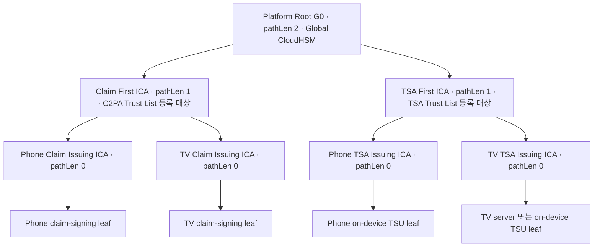

# Root 및 First ICA 운영 모델

2026-09-16 KST 검토 초안. [확정 요구사항](requirements.md)을 입력으로 작성했다. 아래의 구현·수치 제안은 표준 의무 또는 사용자 확정값이 아니다.

## 1. CA 계층과 신뢰 경계

Root/First의 키와 인증서를 구분해 식별하고, 같은 키를 Claim·TSA·OCSP·업데이트 서명에 겸용하지 않는다. Root G0의 Global/CN 공유는 중앙에 보관된 같은 발급 권한을 사용한다는 뜻이다. 지역별 하위 CA가 필요하면 같은 계층에서 병렬로 추가한다. pathLen=0 아래에 CA를 한 단계 더 추가하지 않는다.

Claim 계층의 pathLen은 [CP]의 Root/First Intermediate/Claim Signing Issuing CA 프로파일과 맞춘다. TSA 계층은 사용자 요구를 반영한 제안이며, [TSA-PROFILE]의 Issuer Name 문구와 AKI 설명 사이 차이는 V02로 남긴다. 이는 서명 체인이 암호학적으로 구성된다는 사실만으로 공식 적합성까지 확정하지 않기 위함이다.

### Root의 C2PA 적용 범위

| 구분 | 확인 및 설계 처리 |
|---|---|
| C2PA 검증 경로 | First를 신뢰 앵커로 선택한 검증 경로는 First까지 구성한다. 범용 Root G0를 외부 C2PA 검증기에 추가할 필요가 있다고 가정하지 않는다. [SPEC], [PKIX] |
| 등록 증빙 | [PROGRAM]의 Certificate Policy 절은 등록하려는 Root 및/또는 Intermediate 인증서의 프로파일 검증과 키 생성 증빙을 요구한다. |
| 운영 준수 | [CP]에는 Root/Intermediate 키 통제 및 Root의 Issuing CA 책임 문구가 있다. 미등록 상위 CA에 대한 포괄적 면제를 검토 원문에서 확인하지 못했다. 적용 해석이 확인되기 전에는 준수·면제 모두를 확정하지 않는다. |
| 공통 Root 정책 | G0에는 키 보호, 다인 통제, 생성 증빙, 백업·복구, 감사, 사고 대응을 우선 채택한다. 범용 G0에 C2PA 전용 발급 조건이나 정책 OID를 무조건 붙이지 않는다. C2PA 참여 CA·프로파일에 적용되는 의무는 자율 완화 대상으로 취급하지 않는다. |

Root 인증서의 pathLen 값만 믿고 모든 검증기에서 동일하게 제한될 것으로 가정하지 않는다. 신뢰 앵커의 제약 처리와 First의 pathLen 처리를 실제 대상 검증기에서 확인한다.

## 2. Global/CN 발급 흐름

1. 플랫폼이 자신의 하위 CA 키를 생성하고 CSR과 키 생성·보호 증빙을 준비한다. 개인키는 보내지 않는다.
2. 승인된 반입 경로로 CSR, 플랫폼/지역, 용도, 공개키 지문, 유효기간 요청을 중앙에 전달한다. CSR의 서명과 요청자의 발급 권한은 별도 검증한다.
3. 중앙은 과거 발급 키와의 중복 여부 및 인계 증빙을 확인하고, 프로파일을 적용해 발급 예정 인증서 내용을 확정한 뒤 2인 통제 아래 서명한다. 같은 키로 새 인증서를 만드는 요청은 [교체 절차](#rekey)에 따라 거부한다.
4. 인증서·체인·지문·상태 조회 URL·인계 기록을 비동기로 전달한다. 수신자는 자신이 생성한 공개키와 대조한다.
5. 플랫폼은 일상 leaf 발급을 자체 수행한다. 중앙 Root에 매번 연결하지 않는다.

인증서 발급 경로의 실시간 지역 간 의존성은 제거한다. 다만 CSR 전달, 인증서 수령, 폐지 상태, OCSP 응답, 신뢰 목록 갱신에는 승인된 정보 전달 경로가 필요하다. Global에서 서명한 OCSP 응답·신뢰 번들을 CN 배포 지점에 미러링할 수 있으며 이는 비동기 배포다. 최신 상태가 무기한 전달되지 않아도 된다는 뜻은 아니다.

### 하위 CA 발급·인계 조건

중앙은 Issuing ICA 발급 전에 적용 프로파일과 플랫폼의 운영 조건을 검토하고, 미충족 항목은 발급을 보류하는 조건으로 기록한다. 하위 CA 운영자는 leaf 발급 시 조건을 계속 적용하고 증빙을 보존한다. 플랫폼의 선언만으로 실제 구현 검증이 완료됐다고 판정하지 않는다.

| 대상 | 발급 전 확인 및 인계할 조건 |
|---|---|
| 모든 하위 CA | 요청 권한·키 소유 증명, 키 생성·보호 증빙, 적용 CP/CPS·프로파일 버전, 발급·폐지·상태 제공·기록 보존 절차, 사고 통보 및 운영 종료 시 인계 경로 |
| Claim Issuing ICA | Subscriber 식별·인증, Conforming Products List상의 제품 자격·상태와 허용 Assurance Level 확인, 해당 수준에서 요구하는 Dynamic Evidence 검증, Subscriber Agreement와 인증서 수락 처리 |
| Claim leaf 키 | Subscriber 또는 허용된 위탁 키 관리 시스템이 생성한다. CA는 claim-signing 키를 생성하지 않는다. 제품 인스턴스의 키 통제·공유 제한은 해당 Generator Product Security Requirements에 따라 검증한다. |
| TSA Issuing ICA | TSA 가입자 식별·인증·검증 절차와 [TSA 인계 조건](#tsa-handoff)을 적용한다. Phone/TV가 구현과 일상 운영을 담당한다. |

발급 프로파일은 인증서 종류별 subject, 알고리즘·키 크기, 유효기간, Basic Constraints/pathLen, KU/EKU, 정책 OID, AIA/CDP 및 필수·금지 확장을 버전으로 고정한다. CSR 검증과 별도로 발급 전후의 인증서를 해당 [CP] 프로파일과 대조한다. 이 문서의 계층도만으로 전체 인증서 프로파일 검사를 대신하지 않는다.

## 3. OCSP-only 모델

[CP]의 Certificate Status Services는 하위 CA·TSA 인증서에 OCSP를 제공하지 않으면 CRL을 제공하도록 한다. 따라서 CRL을 발행하지 않는 이 설계에서는 하위 CA·TSA의 상태 제공도 OCSP로 준비한다. 프로파일이 요구하는 `cRLSign` 비트는 실제 CRL 미사용과 별개이므로 임의로 제거하지 않는다.

### 응답자 위임

[OCSP] §2.6/§4.2.2.2의 일반적인 CA 위임 방식은 **조회 대상 인증서를 발급한 CA 키가 응답자 인증서를 직접 서명**하는 방식이다. 별도 로컬 설정으로 신뢰하는 OCSP 응답자도 RFC상 가능하지만 외부 C2PA 검증기가 이를 설정했다고 가정할 수 없다.

| 상태를 응답할 인증서 | 응답자 인증서를 직접 발급할 CA | 응답자 키 운영 |
|---|---|---|
| Claim/TSA First ICA 인증서 | Platform Root G0 | 중앙 OCSP 서비스의 G0 전용 키 |
| Phone/TV Issuing ICA 인증서 | 해당 Claim/TSA First ICA | 중앙 OCSP 서비스의 First별 키 |
| Claim-signing leaf | 해당 플랫폼 Claim Issuing ICA | 플랫폼 또는 위탁 OCSP 서비스의 해당 CA 전용 키 |
| TSU leaf | 해당 플랫폼 TSA Issuing ICA | 플랫폼 또는 위탁 OCSP 서비스의 해당 CA 전용 키 |

응답자 인증서는 CA가 아닌 leaf다. [OCSP-PROFILE]의 `cA=FALSE`, `digitalSignature`, `id-kp-OCSPSigning`, `OCSP NoCheck`를 적용한다. 온라인 응답자 키는 Root/First와 별도 권한·실행 환경에 둔다. 서버 프로그램·배포 지점은 공유할 수 있지만, issuer별 데이터와 키 선택은 분리한다.

G0를 체인의 신뢰 앵커로 가진다는 사실만으로 G0 아래 임의의 응답자가 모든 CA의 상태를 서명할 권한을 얻지는 않는다. 또한 First 자체를 C2PA 신뢰 앵커로 사용하는 검증기는 G0까지 올라가 First의 OCSP를 확인한다고 가정하지 않는다. **앵커의 신뢰 제거는 Trust List/단말 신뢰 저장소 갱신으로 처리**한다.

G0의 자기서명 Root 인증서는 OCSP로 자기 신뢰를 폐지하는 대상으로 삼지 않는다. CP Root 프로파일도 Root 인증서의 AIA/CDP를 금지한다. G0가 발급한 응답자 leaf는 G0가 발급한 First 인증서의 상태를 응답하기 위한 것이다.

### 상태와 가용성

- 발급 원장에는 issuer 키 식별자·serial·subject·유효기간·X.509v3 확장과 값·인증서 원문·상태·폐지 시각·사유를 기록한다. `issuer + serial`로 조회하고 [기록 보존 정책](#records)에 따라 보관한다.
- Claim-signing 인증서의 OCSP 응답은 인증서 만료 시 종료하지 않는다. [CP]는 필수 기록 보존 기간까지 응답 제공을 요구하므로, 최소한 인증서 만료 후 1년까지 제공한다. 이 설계에서는 하위 CA·TSU 인증서에도 같은 최소 기간을 적용하는 공통 운영 정책을 채택한다. 후자의 기간은 CP가 이 두 종류에 동일하게 명시한 값이 아닌 설계 정책이다.
- 응답자에는 승인된 상태 스냅샷을 전달한다. 알 수 없는 serial을 관행적으로 `good`으로 반환하지 않는다.
- 응답은 `thisUpdate`/`nextUpdate`를 넣어 캐시한다. 초기 검토값은 응답 유효기간 24시간, 정상 재생성 주기 6시간 이하이며, 사고 시 즉시 재생성과 캐시 무효화를 시도한다. 이미 유효하게 서명된 캐시 응답을 모든 외부 검증기에서 즉시 무효화할 수는 없다.
- 수치 확정은 Global/CN 전달 지연과 사고 시 허용 노출 시간을 기준으로 한다. 외부 C2PA 검증기의 온라인 조회/오프라인·stapling 동작을 중앙이 강제할 수 있다고 가정하지 않는다. [SPEC] §15.9
- `NoCheck` 응답자 인증서는 자신의 폐지를 일반 OCSP 재귀 확인으로 해결하지 않는다. 짧은 유효기간·키 교체·자체 검증기의 차단 정책을 사용하되, 외부 검증기의 즉시 차단은 보장하지 못한다. 초기 후보인 유효기간 30일은 Root/First의 응답자 키·인증서 교체 작업량과 함께 검토한다. 같은 응답자 키에 새 인증서를 반복 발급하지 않는다.
- Root/First는 온라인 OCSP 응답마다 서명하지 않는다. 응답자 인증서의 신규 발급과 새 키로 교체하는 때에만 사용한다. 따라서 ICA 발급 외에도 예정된 CA 키 사용이 발생한다.
- 구 CA의 신규 발급 중단·만료·종료 이후에도 필요한 기간 동안 상태 원장과 OCSP 응답 제공을 유지한다. 응답자 키·인증서 교체 및 운영 이관을 미리 준비하고, 유효한 응답을 계속 제공할 대책이 확인되기 전에 관련 CA 키를 파기하지 않는다. 자세한 종료 기준은 [수명주기](#lifecycle)를 따른다.

## 4. TSA 인계 경계

Phone은 on-device TSU를 운영한다. TV는 TSA Issuing ICA를 인수하여 서버 또는 on-device TSU 방식을 선택한다. 중앙이 TSU 시간 소스·TEE·시계 보정 구현을 소유하지 않는다.

중앙 발급 시 플랫폼으로부터 허용 용도, 하위 leaf 발급 프로파일, 키 보호 방식, 필요한 C2PA 준수 증빙, 상태 제공 경로 및 사고 통보 접점을 받는다. 시간 신뢰·오차 관리·TSU 키 관리는 플랫폼의 준수 책임으로 인계한다. 책임 위임이 [CP]의 TSA 요구사항 자체를 없애지는 않는다.

### 플랫폼이 충족할 TSA 조건

아래는 [CP]의 General TSA Requirements, Backend TSA, On-Device TSA에서 가져온 인계 조건이다. 구현 방식은 Phone/TV가 정하며 중앙은 ICA 발급 전 적용 범위와 증빙을 검토한다. `필수`와 `권고`를 구분해 수락 기록에 남긴다.

| 적용 | 조건 | 플랫폼이 제출·유지할 증빙 |
|---|---|---|
| 공통 · 필수 | RFC 3161 TSA로 운영하며 해시 알고리즘, 타임스탬프 서명의 예상 수명, 이용 의무·제약, 검증 방법, 정확도, TSA 이벤트 로그와 보존 기간을 공개한다. | TSA 운영 정책, 공개 위치, 로그 보존·조회 정책 |
| 공통 · 필수 | TSU 시각은 하나 이상의 UTC(k) 연구소가 배포하는 시각으로 소급 가능해야 한다. 정확도를 타임스탬프에 명시하고 실제 시각이 그 범위 안에 있어야 하며 윤초에도 동기화를 유지한다. | 시간 소스와 추적 경로, 정확도 산정, 윤초 처리 시험 |
| 공통 · 권고 | 선언 정확도는 1초 이내를 권고한다. 이는 CP의 SHOULD이며 일률적인 SHALL 기준으로 바꾸지 않는다. | 선언 정확도 및 선택 근거 |
| 공통 · 필수 | 선언 정확도를 벗어나는 시계 오차를 탐지하면 해당 TSU의 타임스탬프 발급을 중단한다. | 오차 주입 시 중단 시험, 정상 시각 회복 확인 후 재개하는 절차 |
| 공통 · 필수 | TSU 서명 키를 타임스탬프 전용으로 사용하고 TSU당 동시에 활성화되는 서명 키는 하나로 제한한다. 요청의 해시 알고리즘은 SHA2-256/384/512만 허용한다. | 키 용도·교체 상태, 비허용 해시 요청 거부 시험 |
| On-device · 필수 | UTC(k)로 소급 가능한 온라인 시간 소스와 **적어도 24시간마다 한 번 동기화를 시도**한다. 매번 동기화에 성공해야 한다는 문구로 해석하지 않는다. | 동기화 시도 기록, 네트워크 단절·재시작·장기 오프라인 시험 |
| On-device · 필수 | TSA 애플리케이션을 TEE에서 실행하고 TSU 서명 키를 TEE 안에서 생성·보관한다. MessageImprint와 선택적 nonce는 TEE 밖에서 받을 수 있다. | TEE 실행 경계·키 수명주기 자료, 외부 반출·비인가 사용 차단 시험 |
| Backend · 필수 | TSU 키를 CP가 허용한 평가를 받은 보안 암호 장치 안에서 생성·보관한다. 허용 기준은 해당 ISO/IEC 15408 EAL 4 이상·동등 평가 또는 FIPS 140-2/140-3 Level 3 이상 등 CP의 Backend TSA 기준과 대조한다. CA용 HSM의 Level 2 기준만으로 이를 충족했다고 판단하지 않는다. | 실제 장치·버전·모드에 대응하는 인증·평가 자료와 배포 구성 |

Phone에는 공통 및 on-device 조건을 적용한다. TV에는 공통 조건과 선택한 형태의 조건을 적용하며 두 형태를 모두 운영하면 각각 증빙한다. 24시간 동기화 시도 실패만으로 즉시 발급 중단 의무가 발생한다고 단정하지 않지만, 오프라인이라는 이유로 선언 정확도 밖의 발급을 허용하지도 않는다. 오프라인 허용 시간·오차 추정·재개 판단은 플랫폼이 설계하고 중앙은 그 결과를 인계 기록에 연결한다.

TSU leaf의 발급·폐지·OCSP·보존 조건도 인계 항목이다. 위 표는 TSA의 운영 요건이며 [TSA-PROFILE]의 First→Issuing 계층 해석 미확인(V02)을 해소한 것으로 간주하지 않는다.

## 5. 수명주기와 역할

실제 조직·인명 지정은 보류한다. 아래 역할은 절차 설계를 위한 이름이다.

| 작업 | 통제 및 결과 |
|---|---|
| 정책/프로파일 변경 | 정책 승인자 2인 검토, 버전·변경 이유 기록, 다음 발급부터 명시 적용 |
| Root/First 생성 | 사전 승인된 ceremony script, HSM 내 생성, 지문·속성·quorum 확인. CP의 독립 입회 또는 기록과 별도로 Trust List 등록 대상에는 Program의 독립 입회·서명된 script 증빙을 준비 |
| ICA/응답자 인증서 발급 | 요청자 → 프로파일 검사 → 2인 승인·실행 통제 → 서명 검증 → 원장 확정·전달 |
| 사용자/권한/quorum 변경 | 키 사용자와 HSM 관리자 역할 구분, 통제 완화 자체에 다인 승인 적용 |
| 백업·복구 | 암호화된 HSM 지원 백업, 원장·프로파일·권한 정책·로그 함께 보존, 원본과 같은 다인 통제, off-site 사본, 공식 계획의 연 1회 검토, 복구 후 quorum·공유 사용자·키 지문 검증 |
| 예정 교체 | 같은 키로 인증서 갱신 금지. 만료 전에 새 키·CSR·인증서 준비, 필요한 하위 교체, 신뢰 목록 선배포, 사용 중단·제거 순서 적용 |
| 폐지·침해 대응 | 서명 차단, 증거 보존, issuer별 상태 변경, 앵커 차단·교체, 플랫폼 통보 |
| 감사 | 요청·TBSCertificate digest·승인·키 식별자·실제 발급 결과 연결, 변경/삭제 권한이 분리된 보관 |
| 종료 | 사고로 긴급 조치가 필요한 경우 외에는 Subscriber에 사전 통보. 새 발급 중단, 남은 검증·기록·상태 제공 의무 이관 또는 유지, 관련 백업을 포함한 키 파기 계획·증빙 |

키 상태는 `준비 → 활성 → 신규 발급 중단 → 폐기`를 기본으로 하고 `침해 의심/확정`은 별도 사고 상태로 둔다. 인증서 상태·단말의 신뢰 상태·개인키 존재 여부는 각각 관리한다. 백업 삭제와 개인키 파기는 사고 기록과 기존 인증서 검증 자료의 삭제를 의미하지 않는다.

### 인증서 교체: 새 키로 발급

[CP]의 Certificate Renewal은 **해당 CA가 이미 인증서를 발급했던 키 쌍에 새 인증서를 발급하는 것**을 금지한다. C2PA 범위의 CA·Claim·TSU·OCSP 응답자 인증서에 적용하며, 이 설계는 공통 G0 운영에도 같은 키 재사용 금지를 채택한다. 이는 미등록 G0의 C2PA 적용 범위를 확정하는 판단이 아니다.

1. 만료·알고리즘 변경·정보 변경 요청을 받으면 새 키를 생성하고 새 CSR과 필요한 증빙을 제출한다. 문서의 인증서 ‘갱신’은 별도 표시가 없는 한 이 re-key 절차를 뜻한다.
2. 발급 CA의 이력에서 공개키를 대조한다. CA 식별자와 실제 issuer 키 식별자를 각각 기록하고, 같은 CA가 서명 키를 교체해도 이전 발급 이력을 조회한다. 비교용 키 식별자는 인코딩 차이로 같은 키가 다른 키처럼 보이지 않도록 알고리즘과 공개키 값을 정규화하여 만들고, 인증서와 원래 SPKI도 함께 보존한다.
3. Subscriber re-key에는 신규 신청과 같은 식별·검증 절차를 적용한다. Subject 변경도 Initial Identity Validation을 거친다. 이미 발급한 인증서를 수정하지 않는다.
4. 새 요청을 승인·서명하고 구/신 인증서의 전환·폐지 여부를 기록한다. OCSP 응답자도 새 키와 새 위임 인증서로 교체한다.
5. 통신 재시도에는 이미 발급한 **동일 인증서**를 재전달할 수 있다. 같은 키에 다른 serial·유효기간의 인증서를 새로 만드는 재발급과 구분한다. 서명 성공 여부가 불확정이면 확인 전 새 발급을 보류한다.

전체 인증서 기록의 최소 보존 기간이 지나도 동일 키 재발급 방지에 필요한 issuer·공개키 식별자·발급 여부는 해당 발급 권한의 운영 기간 동안 유지하는 설계 정책을 적용한다. 이는 개인키 보관을 뜻하지 않는다. 서로 다른 issuer 사이의 교차서명은 같은 issuer의 갱신과 동일시하지 않으며, 필요해지면 별도의 프로파일·정책 검토 대상으로 다룬다.

### 기록 보존과 공개 정책

[CP]의 Repositories에 따라 CP 아래 발급한 모든 인증서의 기록을 **각 인증서 만료 후 최소 1년** 보존한다. 조기 폐지해도 보존 기산점을 폐지일로 앞당기지 않는다. 이 설계는 중앙의 공통 Root/First 발급에도 같은 최소값을 적용한다.

| 기록 | 내용 및 보존 기준 |
|---|---|
| 발급 원장 | serial, subject, 유효기간, X.509v3 확장과 값, 폐지 상태 및 인증서 원문. 인증서별 만료 후 최소 1년, 필요한 경우 더 긴 정책 기간 적용 |
| 발급·관리 증적 | 요청자·수행자·승인자·시각·작업·관련 인자, CSR·프로파일·TBSCertificate digest·검증 결과, 발급·폐지·접근 시도·해당 시 attestation 검증·HSM 관리 기록. 연관 인증서 기록과 함께 최소 같은 기간 보존하는 것을 설계 정책으로 채택 |
| 기타 운영·TSA 로그 | 기록 종류별 보존 기간, 저장·검색·복원 절차를 정책에 명시. CP가 모든 감사 로그에 일률적으로 ‘만료 후 1년’을 정한 것으로 설명하지 않음 |
| 키 생성·백업·복구 증적 | script·입회·승인·서명 기록, 백업 목록, 연간 검토와 복구 시험 결과. 키 수명과 연관 인증서의 남은 의무를 포함하는 보존 기간을 상세 운영 정책에서 확정 |

보관소에는 접근 통제와 정기 감사를 적용한다. 작업 수행자와 로그 변경·삭제 권한을 분리하고, 무단 열람·변조·삭제 방지와 정기 검토를 수행한다. 보존 종료·삭제 승인과 기록 조회·복원 절차도 문서화한다. 보존 정책의 변경은 이미 발생한 최소 의무를 단축하지 못한다.

[CP]의 Publication에 따라 적용 사업 관행을 공개 CPS로 제공하거나 C2PA와 협의해 정한 다른 고지 방법을 사용한다. 이 설계 초안 자체를 CPS나 등록용 준수 선언으로 대체하지 않는다. 폐지 요청 접수, 사고 통보, 상태 서비스, TSA 정확도·제약·로그 보존 등 실제 제공 조건을 고지 문서와 일치시킨다.

### 백업·복구 계획과 연간 검토

[CP]의 Key Backup and Recovery에 따라 공식 계획을 문서화하고 **매년 검토**한다. 검토 기록에는 날짜, 참여 역할, 대상 키·백업·구성, 변경 사항, 결함과 조치 결과, 다음 검토 예정일을 남긴다. 백업 존재 여부 확인만으로 복구 가능성을 확인했다고 판단하지 않는다.

- 모든 CA 개인키 백업을 목록화하고 원본과 같은 다인 통제로 보호한다. 최소 하나의 off-site 사본을 유지한다. CloudHSM의 복제만으로 이 조건을 충족했다고 가정하지 않고 실제 저장·장애 영역과 복구 권한을 확인한다.
- 개인키는 암호 모듈 밖에 평문으로 반출·저장하지 않는다. 원장·설정·프로파일·권한 정책·감사 로그도 복구에 필요한 버전으로 백업한다.
- 정기 복구 시험을 수행한다. **연 1회 이상 및 주요 구성 변경 후 시험**은 본 설계의 주기 제안이다. CP가 명시한 연간 주기는 계획 검토에 대한 것이며 둘을 혼동하지 않는다.
- 복구 시험은 키 지문, 원장·폐지 상태, 접근 권한·quorum, 1인 우회 차단, OCSP 운영 재개를 확인하고 증빙을 남긴다. 목표 복구 시간은 아래 제안값과 별도로 측정한다.
- CA 개인키의 운영 복구용 백업과 장기 기록 아카이브를 구분한다. [CP]는 CA 개인키 아카이빙을 금지한다. 남은 운영 의무를 처리한 뒤 개인키와 관련 백업을 폐기하고, 공개 인증서·발급 기록·감사 증빙은 보존 정책에 따라 유지한다.

### 복구와 운영 목표 제안

CA 서명 작업은 즉시 응답 서비스로 만들지 않는다. 초기 운영 목표 후보는 예정 발급 처리 2영업일, 중앙 서명 환경 복구 1영업일이다. OCSP와 신뢰 목록 배포는 별도 가용성 목표를 가진다. 이 값들은 표준이 요구하는 수치가 아니다.

서명 전 요청·승인과 예상 serial을 영속화한다. 서명 후 원장 기록에 실패하면 해당 serial을 불확정 상태로 두고 확인 전 재발급·공개를 막는다. 재시도는 같은 요청 ID로 중복 여부를 먼저 확인한다. 암호 연산 자체가 성공한 시점과 발급 원장 확정 시점의 차이를 복구 절차에 포함한다.

HSM 백업과 발급 원장을 각각 복구해 키 지문·발급 serial·폐지 상태가 일치하는지 확인한다. 외부로 전달된 인증서 기록을 잃으면 복구 완료로 판정하지 않는다. 다른 Global 리전의 암호화 백업 복구 가능성과 HSM 모델·계정 경계는 PoC에서 확인한다. CN 복제는 복구안에 포함하지 않는다.

### 폐지와 사고 접수

[CP]의 Certificate Revocation에 따라 적용 대상 인증서를 폐지해야 하는 사건을 운영 절차에 포함한다. 제품 목록 상태가 `revoked`로 시작하는 상태로 바뀐 경우, 검증된 C2PA Governing Authority 또는 Subscriber 요청, 제품 침해 의심·확정 또는 해당 Assurance Level의 attestation 실패, 개인키 노출 확인, CP 미준수, 인증서 오용을 접수·판단할 경로를 둔다. 단순한 키 만료 관리만으로 폐지 절차를 대신하지 않는다.

상태 변경은 요청 진위·대상·사유 확인 → 권한 있는 승인 → 원장 반영 → OCSP 재생성·배포 → 플랫폼 통보·증적 보존으로 연결한다. 플랫폼이 leaf 발급을 맡더라도 제품 상태 변경과 사고가 해당 Issuing CA에 전달되도록 인계한다. 접수·판단·배포의 처리 시간과 긴급 대응 역할은 운영 정책에서 확정하며, 조직명 지정은 계속 보류한다.

| 사고 | 대응 순서 |
|---|---|
| 서명 환경 장애, 키 무침해 | 신규 작업 보류 → 승인된 환경/백업 복구 → 통제·원장 대조 → 재개 |
| 플랫폼 ICA 침해 | 해당 issuer 신규 발급 중단 → 상위 CA의 OCSP에 폐지 반영 → 대체 ICA → 플랫폼 재발급 |
| First 침해 | 하위 발급 중단 → 상위 OCSP 갱신과 별개로 C2PA Trust List/단말에서 First 신뢰 제거 추진 → 새 First 등록·배포 |
| G0 침해 | G0 서명 차단 → Global/CN 전체 영향 조사 → 독립 업데이트 권한으로 G0 제거·교체 → 하위 키별 노출 조사·재발급 |
| OCSP 응답자 키 침해 | 응답 서비스 격리·키 교체 → 신규 위임 인증서 → 자체 차단·외부 통보; NoCheck/기존 응답 유효기간에 따른 노출은 별도 추적 |
| 승인자 부재/자격 상실 | 대체 승인자 또는 보호된 관리자 절차 사용. 임시 1인 서명으로 우회하지 않는다. |

일반 수명주기·침해 복구의 근거는 [NIST-KM]이며, 숫자·구현 구성은 본 설계의 제안이다. 단말 복구 방식은 [교체 설계](trust-anchor-migration.md)로 이어진다.

## 6. 상세 설계의 검증 항목

1. First 등록 시 상위 G0의 운영 책임 해석, TSA First→Issuing 프로파일 적용.
2. Root/First의 HSM 다인 승인, 백업 복구 후 통제 유지 및 관리자 우회 차단.
3. 실제 Phone/TV·외부 C2PA 검증기의 OCSP 직접 위임, NoCheck, pathLen, First 앵커 처리.
4. Global/CN의 비동기 반입·반출 및 OCSP/신뢰 목록 지연·만료 처리.
5. 단말에 저장된 실제 신뢰 앵커·업데이트 권한·ROM/OTP 제약 조사.
6. 동일 키의 새 인증서 발급 차단, 기존 인증서 재전달, 불확정 서명 복구 및 새 키 교체 시험.
7. 만료 후 보존·OCSP 지속 제공, 조기 폐지 기록 보존, 종료 시 상태 서비스 이관 시험.
8. 연간 백업 계획 검토 증적과 정기 복구 시험, TSA 형태별 인계 증빙·오차 초과 중단 시험.

항목별 원문 근거·설계 위치·미완료 증빙은 [C2PA 요구사항 대응표](c2pa-requirements-matrix.md)에서 관리한다. 문서 반영과 실제 적합성 확인은 별개의 상태다.

[CP]: https://github.com/c2pa-org/conformance-public/blob/7b2fcb3ca5f60bbd4c6dfc6ccfaccaaa5ff9fc50/docs/v0.2/C2PA%20Certificate%20Policy.md
[PROGRAM]: https://github.com/c2pa-org/conformance-public/blob/7b2fcb3ca5f60bbd4c6dfc6ccfaccaaa5ff9fc50/docs/v0.2/C2PA%20Conformance%20Program.md
[TSA-PROFILE]: https://github.com/c2pa-org/conformance-public/blob/7b2fcb3ca5f60bbd4c6dfc6ccfaccaaa5ff9fc50/docs/v0.2/cert-profiles/tsaIssuingCA.cert.yaml
[OCSP-PROFILE]: https://github.com/c2pa-org/conformance-public/blob/7b2fcb3ca5f60bbd4c6dfc6ccfaccaaa5ff9fc50/docs/v0.2/cert-profiles/ocspResponderLeaf.cert.yaml
[SPEC]: https://spec.c2pa.org/specifications/specifications/2.4/specs/C2PA_Specification.html
[PKIX]: https://www.rfc-editor.org/rfc/rfc5280.html#section-6
[OCSP]: https://www.rfc-editor.org/rfc/rfc6960.html#section-4.2.2.2
[NIST-KM]: https://nvlpubs.nist.gov/nistpubs/SpecialPublications/NIST.SP.800-57pt1r5.pdf
