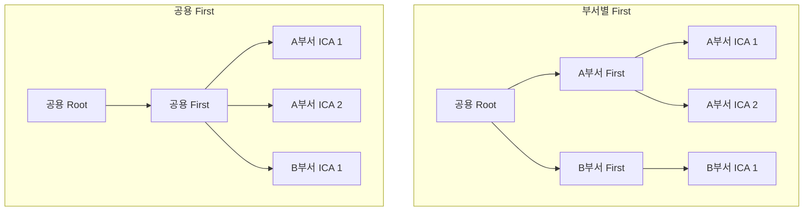
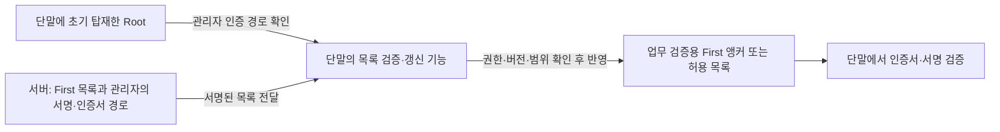
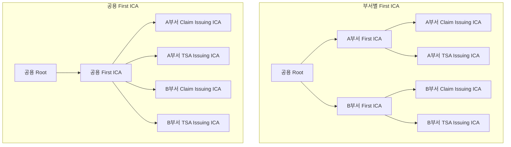

# RV-001 — 부서별 CA 계층과 운영 책임

- 작성일: 2026-09-21 KST · 정리일: 2026-09-21 KST
- 상태: 검토 중
- 관련 설계: S01, S04, S06, S07, S09
- 관련 요구사항·과제: [R05, R10, R12, D06, V04](../requirements.md)
- 문답: [Q02](../design-dialogue-log.md#q02), [검토 순서 정정](../design-dialogue-log.md#review-order), [Q03 — 장단점 비교](../design-dialogue-log.md#q03), [Q04 — 단말 고정과 FOTA](../design-dialogue-log.md#q04), [Q05 — Root 탑재와 서버 신뢰 관리](../design-dialogue-log.md#q05)
- 선행 검토: 없음
- 후속 검토: [RV-002 — 부서별 구조에 따른 ICA 용도와 사용 방식](002-purpose-ica-usage.md)
- 연결된 확정 결정: 없음

## 이번 검토에서 정할 것

먼저 부서별 CA 계층과 중앙·부서의 운영 책임을 정한다. 이 결과를 입력으로 RV-002에서 각 부서가 사용할 ICA의 용도와 사용 방식을 검토한다.

비교할 구조는 다음 두 가지다.

1. **부서별 First ICA:** 공용 Root가 부서별 First를 발급하고, 부서에서 필요한 ICA들을 해당 First 아래에 둔다.
2. **공용 First ICA:** 공용 Root 아래 First 하나를 두고, 각 부서가 요청한 ICA들을 그 아래에서 구분한다.

ICA별 개인키 관리·발급 권한과 검증 시스템의 신뢰 앵커를 함께 검토한다. Claim/TSA의 구체적인 배치와 용도별 키 분리 결정은 RV-002에 남긴다.

단말 인증서를 FOTA로만 변경할 수 있다는 조건은 First 구조의 선택에 직접 영향을 주므로 이 검토에 포함한다. S07의 단말 신뢰·갱신 제약을 먼저 확인하고, 그 조건을 포함한 구조 선택 결과를 RV-002로 넘긴다.

## 비교 전제와 구조

각 부서가 요청한 ICA는 별도 키·인증서를 가진다고 가정한다. 이름만 다른 인증서가 같은 키를 공유한다는 의미로 확정하지 않는다. 아래 ICA 1·2는 아직 용도를 정하지 않은 예시이며, 추가 CA 계층을 뜻하지 않는다.

## 장단점을 비교하는 기준

부서별 First의 주된 이점은 **부서 단위의 상위 CA를 독립적으로 관리·교체·위임할 수 있는 구조**다. 공용 First의 주된 이점은 **관리할 상위 CA를 줄이고 공통 운영을 한곳에 모으는 구조**다. 부서별 하위 ICA의 키 분리와 일상적인 leaf 발급은 두 안 모두에서 가능하므로, 이를 부서별 First만의 장점으로 계산하지 않는다.

아래는 앞의 계층에서 도출한 설계 분석이다. 구조만으로 달라지는 수량과, 운영 권한·신뢰 설정에 따라 달라지는 효과를 구분한다. 특정 구조를 요구하는 표준 규칙이나 검증 완료 결과가 아니다.

### 운영과 수명주기 비교

| 항목 | 부서별 First의 장점·단점 | 공용 First의 장점·단점 |
|---|---|---|
| First 관리량 | **단점:** 부서마다 키 생성·승인자 설정·백업·복구 확인·감사·교체 대상을 관리 | **장점:** First 하나의 수명주기를 관리. 부서별 하위 ICA 관리는 계속 필요 |
| 새 부서 도입 | **단점:** 해당 부서 First의 생성과 Root 서명 절차가 먼저 필요 | **장점:** 기존 First 아래에 새 부서 ICA를 발급할 수 있어, 같은 계층·정책을 유지하는 범위에서는 새 First 발급을 위한 Root 작업이 불필요 |
| 기존 부서의 ICA 추가 | 해당 부서 First가 발급. First를 중앙이 운영하면 여전히 중앙 요청·승인을 거침 | 공용 First가 발급. 두 안 모두 이 작업 자체에 Root 서명이 필요한 것은 아님 |
| 운영 권한 위임 | **조건부 장점:** First의 사용 권한까지 부서에 위임하면 승인된 범위의 하위 ICA 발급을 부서가 운영 가능. **단점:** 부서의 키 통제·인력·감사·복구 역량을 관리해야 함 | **장점:** First 운영 역량을 중앙에 집중. **단점:** 하위 ICA 추가·교체는 공용 First 운영 주체에 의존. 부서별 요청 승인과 하위 ICA 운영은 위임할 수 있음 |
| First 교체 일정 | **장점:** 한 부서 First의 변경 일정을 해당 계층 중심으로 잡을 수 있음. **단점:** 서로 다른 일정·버전·상태의 First를 동시에 추적 | **장점:** 관리할 First 교체 절차는 적음. **단점:** 해당 First에 의존하는 여러 부서의 체인·신뢰 배포·수락 조건을 함께 검토 |
| First 서명 중단 | **조건부 장점:** 키·실행·승인 경로가 분리돼 있으면 해당 부서의 ICA 추가·교체에 영향을 제한 | **단점:** 공용 First 서명 중단은 그 First가 발급하는 모든 부서 ICA의 추가·교체를 막음 |
| 부서 전체 신규 발급 중단 | **장점:** 부서 First와 하위 ICA 집합을 관리 단위로 삼을 수 있음. First만 중단해도 기존 하위 ICA가 자동으로 멈추는 것은 아니므로 각각의 발급 중단도 필요 | **단점:** 부서 소유 ICA 목록을 기준으로 대상들을 찾아 중단해야 함. **장점:** 다른 부서를 위해 공용 First를 계속 운영할 수 있음 |
| 정책 일관성 | 부서별 예외·일정·승인 체계를 나누기 쉬움. **단점:** 실제 운영을 위임하면 정책 편차와 미준수 감시 부담 증가 | 공통 발급 정책·실행기를 한곳에서 관리하기 쉬움. **단점:** 공통 정책 오류·관리 권한 오용의 영향이 여러 부서로 넓어질 수 있음 |
| 조직 개편 | 부서 CA 집합의 관리 경계가 명확. **단점:** 부서 분할·통합 시 First의 유지·소유권 이관·교체까지 검토할 수 있음 | 부서별 상위 CA를 이관하는 일은 적음. **단점:** 하위 ICA의 소유·권한·정책 연결을 빠짐없이 갱신해야 함 |
| 신뢰 목록·배포 | First를 직접 등록·배포하는 정책이면 부서별로 신뢰를 관리하기 쉬움. **단점:** 대상 First가 늘어남 | First를 직접 등록·배포하는 정책이면 대상 수가 적음. **단점:** 공용 First의 신뢰 변경을 여러 부서와 조율해야 함 |

First 수는 HSM 수, 실행 서버 수 또는 외부 심사 횟수와 같지 않다. 위 표는 관리할 키·인증서·정책 대상의 차이를 설명하며 비용이 같은 비율로 늘어난다는 추정은 하지 않는다. 조직 이름 변경만으로 키 교체가 반드시 필요한 것도 아니다. 실제 인증서 정보·정책·책임 변경을 따로 검토한다.

### 수량으로 확인할 수 있는 차이

부서는 N개, 전체 부서가 필요로 하는 하위 ICA는 합계 K개이고, 키 교체 중 공존하는 CA·OCSP 응답자·leaf는 제외한다.

| 대상 | 부서별 First | 공용 First |
|---|---|---|
| Root | 1 | 1 |
| First | N | 1 |
| 하위 ICA | K | K |
| 전체 CA 키·인증서 | 1 + N + K | 2 + K |
| 최초 First 인증서를 발급하는 Root 서명 횟수 | N | 1 |

예를 들어 부서 5개가 각각 하위 ICA 3개를 사용하면 K=15다. 전체 CA는 부서별 First안에서 21개, 공용 First안에서 17개이며 First 관리 대상이 4개 차이 난다. 필요한 부서별 하위 ICA 15개는 두 안에서 동일하다. 일상 leaf 서명 성능이나 체인 깊이가 이 수량 차이만으로 개선되는 것은 아니다.

### 장애와 침해는 나누어 비교

| 사건 | 부서별 First | 공용 First | 비교 조건 |
|---|---|---|---|
| 한 부서의 하위 ICA 키만 침해 | 그 하위 ICA와 관련 경로를 조사·차단 | 동일하게 그 하위 ICA와 관련 경로를 조사·차단 | 하위 ICA 키 분리는 두 안 모두에서 가능하며 부서별 First만의 이점이 아님 |
| 특정 First 키만 침해 | 부서별 권한·신뢰 제한이 실제로 적용돼 있으면 해당 부서 계층 중심으로 대응 범위를 제한할 수 있음 | 그 First가 여러 부서의 신뢰 경로에 쓰이면 여러 부서 경로가 함께 영향받음 | 다른 부서의 경로 위조를 실제 검증자가 거부하는지 확인해야 함 |
| First 키의 사용 중지·승인자 부재 | 해당 First만 영향을 받도록 운영 경로를 분리할 수 있음 | 공용 First의 모든 하위 ICA 추가·교체에 영향 | 정상인 기존 하위 ICA의 leaf 발급이 자동 중지된다는 뜻은 아님 |
| 공용 HSM·실행기·관리자 계정 장애 또는 침해 | First가 여러 개여도 공유하는 자원·권한을 통해 여러 부서에 영향 가능 | 공용 First와 연결된 부서에 영향 가능 | CA 키 수와 인프라 장애 영역은 별개 |
| 공용 Root 사고 | 공유 Root의 발급·관리·복구 의존성을 함께 검토 | 동일 | 실제 검증 영향은 사용 중인 신뢰 앵커·제약·대체 경로에 따라 판단 |

**격리가 성립하는 조건:** 부서마다 다른 키를 두는 것과 함께 키 접근 권한, 서명 실행 경로, 요청 대상 부서·프로파일의 검증, 검증자의 신뢰 범위를 정해야 한다. 공용 Root 아래의 제한 없는 First를 모든 부서가 받아들이는 구성이면 다른 부서 이름의 인증서를 만드는 경로까지 살펴야 한다. 부서명이 다른 것만으로 검증 격리를 입증하지 않는다.

**신뢰 차단의 조건:** 부서 First를 경유하는 경로를 차단하면 그 경로를 중단할 수 있지만, 하위 ICA를 직접 신뢰하거나 다른 경로를 허용하면 추가 조치가 필요하다. First 자체가 신뢰 앵커인 경우의 제거·차단도 별도로 설계한다. 한 First의 폐지나 서명 중단만으로 부서 전체의 모든 발급·검증·과거 서명이 일괄 중단된다고 적지 않는다. 신뢰 앵커 선택과 경로별 제약은 [RFC 5280 §6](https://www.rfc-editor.org/rfc/rfc5280.html#section-6)을 근거로 확인한다.

### 단말에 인증서를 고정하고 FOTA로만 변경하는 경우

**비교 전제:** 사용자 요청에 따라 First 인증서나 공개키를 단말에 고정하고 FOTA로만 변경할 수 있는 경우를 중심으로 비교한다. 실제 단말의 고정 대상과 검증 방식은 아직 확인하지 않았다. 기존 R10의 Root 탑재 요구를 모든 단말의 First 직접 신뢰로 바꾸어 확정하는 것은 아니다.

먼저 인증서를 저장한 목적을 구분해야 한다. 신뢰 앵커는 경로 검증의 입력이고, 보관 중인 중간 인증서와 역할이 다르다. 아래 차이는 [RFC 5280 §6.1.1](https://www.rfc-editor.org/rfc/rfc5280.html#section-6.1.1)과 [§6.2](https://www.rfc-editor.org/rfc/rfc5280.html#section-6.2)를 바탕으로 한 구현 조건별 분석이다.

| 단말에서의 사용 방식 | First 교체와 FOTA의 관계 |
|---|---|
| First를 직접 신뢰 앵커로 사용 | 신뢰할 First 키를 바꾸려면 단말의 신뢰 설정을 변경해야 한다. 그 유일한 수단이 FOTA라면 FOTA가 필요하며, 같은 Root가 발급했다는 사실만으로 새 First가 신뢰되지는 않음 |
| First 인증서 전체 또는 공개키를 고정하여 일치 여부를 검사 | 인증서 전체 고정은 인증서 변경에, 공개키 고정은 키 변경에 영향을 받음. 실제 비교 대상·검증 절차를 확인해야 하며 단순히 같은 이름으로 재발급해서 해결할 수 있다고 가정하지 않음 |
| Root를 신뢰하고 First는 체인 구성용으로 보관 | 새 First 체인을 외부에서 받아 검증할 수 있고 별도 First 고정·알고리즘·정책 제약이 없다면, 같은 Root 아래 First 교체는 신뢰 저장소의 FOTA 없이 가능할 수 있음. 코드가 내장 First만 사용하면 여전히 FOTA가 필요 |

이하의 장단점은 **First 변경 시 FOTA가 필요한 경우**의 설계 분석이다. 부서별 First의 단말 영향 격리는 필요한 부서 First만 신뢰하고, 다른 First나 공용 Root를 통한 우회 신뢰 경로도 제한하는 조건을 둔다.

| 상황 | 부서별 First | 공용 First |
|---|---|---|
| 정상적인 First 키 교체 | **장점:** 해당 First를 신뢰하는 단말군의 일정에 맞춰 교체 가능. **단점:** 부서별 구·신 키, 펌웨어 버전, 전환 완료율을 각각 관리 | **장점:** 관리할 First 버전과 공통 전환 계획이 적음. **단점:** 공용 First를 신뢰하는 모든 단말군의 FOTA 준비·배포 상황을 조율해야 함 |
| First 키 침해에 따른 긴급 제거 | **조건부 장점:** 신뢰 범위가 나뉘어 있으면 관련 단말군 중심으로 긴급 FOTA를 진행. **단점:** 부서별로 긴급 배포·복구 능력이 필요 | **단점:** 그 First를 신뢰하는 여러 부서·제품에 긴급 FOTA가 필요할 수 있음. **장점:** 제거 대상과 대응 절차를 공통으로 관리하기 쉬움 |
| 장기 미접속·갱신 지연 단말 | **장점:** 다른 First만 쓰는 단말군의 전환을 별도로 진행 가능. **단점:** 해당 단말군의 구 키 잔존 문제는 그대로 남음 | **단점:** 전체를 한 번에 전환하려 하면 갱신이 가장 느린 단말군이 제약이 됨. 군별 전환은 가능하나 구·신 체인 제공과 호환성 운영이 추가로 필요 |
| 서로 다른 제품 지원 기간 | **장점:** 부서별 지원·교체 주기가 실제로 나뉘면 독립 계획 가능. **단점:** 부서 안에 여러 세대가 섞이면 그 안의 조율은 여전히 필요 | **장점:** 지원 정책과 교체 주기를 통일하기 쉬움. **단점:** 장수명·지원 종료 제품의 구 First와 신규 제품의 새 First를 함께 관리할 수 있음 |
| 기존 단말이 새 부서의 인증서를 검증해야 함 | **단점:** 해당 부서 First가 없으면 신뢰 추가를 위한 FOTA가 필요. 미리 모든 First를 넣으면 배포 범위를 나누는 이점이 줄어듦 | **조건부 장점:** 이미 신뢰하는 First 아래 새 부서 ICA를 허용하면 First 추가 FOTA를 피할 수 있음. 별도 허용 목록·프로파일·코드 변경 여부는 확인 필요 |
| 하위 ICA만 추가·교체 | First가 그대로이고 새 하위 체인을 수용하면 First 때문에 FOTA할 필요는 없음 | 동일. 이 이점은 두 구조에 공통이며 하위 ICA까지 고정한 단말에는 적용되지 않음 |
| 펌웨어 배포·검증 비용 | **단점:** 단말군별 신뢰 목록과 호환성 조합 관리 증가. **장점:** 한 부서 변경 시 관련 없는 단말군의 배포를 피할 수 있음 | **장점:** 공통 목록의 내용·버전 관리가 단순. **단점:** First 하나여도 제품·세대별 펌웨어 빌드·검증·배포가 각각 필요할 수 있음 |

**FOTA 대상 수는 First 수와 같지 않다.** A·B·C 단말군의 단순 예시에서 공용 First F를 모두 신뢰하면 F 제거 대상은 A·B·C다. A는 FA, B는 FB, C는 FC만 신뢰하면 FA 제거 대상은 A로 한정할 수 있다. 그러나 A·B·C 모두에 FA·FB·FC를 넣었다면 FA 제거도 A·B·C에 배포해야 한다. 이때도 B·C가 정상 FB·FC를 계속 쓸 수 있다는 장점은 남지만, 긴급 FOTA 대상이 A로 한정되는 것은 아니다. 실제 대상은 부서 소유 관계가 아닌 **단말별 신뢰 목록과 허용 경로**로 산정한다. 제한된 단말군에 신뢰 앵커를 설치하고 사용 범위를 관리하는 문제는 [RFC 6024 §3.3](https://www.rfc-editor.org/rfc/rfc6024.html#section-3.3)에서 다룬다.

#### 정상 교체와 침해 대응에서 달라지는 점

정상 교체에서 구·신 First를 함께 신뢰할 수 있다면 다음 순서를 검토한다. 현재 단말이 복수 앵커나 복수 고정 값을 지원한다고 가정하지는 않는다.

1. FOTA로 새 First를 먼저 추가하고 구 First와 공존시킨다.
2. 대상 단말군의 적용 상태와 새 체인 검증을 확인한 뒤, 새 First 아래의 발급·서비스 사용으로 전환한다. 갱신하지 않은 단말은 새 First만으로 이어지는 체인을 거부할 수 있으므로 지원·전환 기준을 정한다.
3. 구 First 사용 종료 조건과 기존 서명 검증 정책을 확인하고 FOTA로 구 First를 제거한다. 추가와 제거는 별도 배포 단계가 될 수 있으며, 모든 단말에 정확히 같은 횟수의 FOTA가 필요하다는 뜻은 아니다.

고정 값 하나만 허용하는 단말은 이 공존 절차를 그대로 쓸 수 없다. 먼저 FOTA로 공존 기능을 도입할 수 있는지, 불가능하면 단말군별 교체와 서비스 전환을 어떻게 맞출지 확인한다. 새 인증서를 먼저 발급하는 것만으로 기존 단말의 수락 문제가 해결되지는 않는다. 일정에는 펌웨어 개발·검증·배포, 미접속 단말의 복귀, 제품 지원 종료와 인증서·키 사용 기간을 반영한다. 신뢰 앵커 인증서의 만료 처리도 일반 중간 인증서와 동일하다고 단정하지 않고 실제 검증기에서 확인한다.

**침해 대응에서는 구 First를 계속 신뢰하는 공존 기간 자체가 위험 기간이다.** 새 First를 추가해도 침해된 First에 대한 신뢰가 남아 있으면 위조 경로를 수락할 수 있다. First를 직접 앵커로 쓰는 단말에서 Root가 그 First 인증서를 폐지하거나 서버가 서명을 중단했다는 이유만으로 내장 신뢰가 자동 제거된다고 보지 않는다. 앵커 제거·차단 및 대체 경로의 실제 동작을 확인한다. 신뢰 앵커와 검증 경로의 구분은 [RFC 5280 §6](https://www.rfc-editor.org/rfc/rfc5280.html#section-6)에 따른다.

FOTA가 유일한 변경 수단이라면 갱신하지 못한 단말의 내장 신뢰는 서버 측 키 교체만으로 고칠 수 없다. 정상 교체의 호환 기간과 사고 시 허용 위험 기간을 따로 정하고, 지원 종료 단말은 가능한 서비스 제한·물리 복구·지원 종료 처리와 남는 위험을 검토한다. 온라인 서비스 차단도 단말의 오프라인 검증 신뢰를 제거하는 수단은 아니다.

복구용 FOTA의 서명·설치 권한과 다운로드 경로가 침해된 First 때문에 함께 위조되거나 막히는지도 확인해야 한다. 구 펌웨어로 되돌려 제거한 First가 복원되는 경로도 검토한다. 인증된 신뢰 변경, 재전송 방지, 침해 복구의 근거는 [RFC 6024 §3.8–3.11](https://www.rfc-editor.org/rfc/rfc6024.html#section-3.8)이며, 여기의 FOTA 절차는 이를 참고한 프로젝트 제안이다. [신뢰 앵커 교체 문서](../trust-anchor-migration.md)의 독립 업데이트 권한·신뢰 번들은 향후 도입 제안이므로, 현재 FOTA 없이 갱신할 수 있는 기능으로 계산하지 않는다.

#### 구조를 선택하기 전에 확인할 단말 조건

- **고정 대상:** Root/First 중 무엇을 신뢰하며 인증서 전체·공개키 중 무엇을 비교하는가? 체인 구성용 내장 인증서인지도 구분한다.
- **신뢰 범위:** 단말군마다 필요한 부서 First만 넣는가, 여러 부서 First를 함께 넣는가? 다른 부서의 인증서를 받아야 하는 사용 범위는 어디까지인가?
- **공존·제거:** 구·신 First 동시 수용, 새 하위 체인 수용, 앵커 제거·폐지·만료 처리, 다른 경로와 구 펌웨어 복귀의 동작은 무엇인가?
- **배포 현실:** 단말군별 FOTA 책임자·주기·긴급 배포 시간·갱신 완료율·지원 종료 정책은 무엇인가?
- **복구 권한:** 교체 대상 CA가 침해돼도 FOTA를 안전하게 검증·설치할 수 있는가?

이 조건은 V04의 조사 결과로 채운다. 현재는 두 구조의 비교 조건이며 특정 단말 기능이나 운영 정책의 확정이 아니다.

### Root만 단말에 탑재하고 First를 서버에서 관리하는 경우

**추가 입력:** 사용자는 First를 탑재하려면 self-signed Root도 함께 넣어야 한다고 설명하고, 단말에는 Root만 넣고 서버가 First를 신뢰 앵커로 관리하는 방식의 가능성을 물었다. 현재 단말의 구현 제약과 일반적인 PKI 구조를 구분한다. 아래는 추가 비교이며 새 방식의 채택이나 현재 단말 기능의 확인이 아니다.

#### First와 상위 Root를 반드시 함께 넣어야 하는가

신뢰 앵커는 검증자가 신뢰하도록 설정한 CA이며 반드시 계층 최상위의 self-signed Root일 필요는 없다. First를 직접 앵커로 설정하고 그 지점에서 경로 검증을 끝내는 검증기라면 상위 Root 없이도 검증할 수 있다. Root의 자체 서명 때문에 신뢰가 생기는 것이 아니라, 안전한 초기 탑재 등으로 신뢰 근거를 설정한다. 근거: [RFC 5280 §6](https://www.rfc-editor.org/rfc/rfc5280.html#section-6), [§6.1.1](https://www.rfc-editor.org/rfc/rfc5280.html#section-6.1.1).

반면 현재 단말이 self-signed Root까지 경로를 구성하도록 구현돼 있거나 제품 정책이 이를 요구하면, 그 구현에서는 Root가 필요하다. 따라서 사용자의 설명은 단말 조사 입력으로 기록하고 V04에서 검증 API·신뢰 저장소·경로 종료 조건을 확인한다. Root와 First를 함께 넣었을 때도 First가 신뢰 앵커인지 단순 중간 인증서인지 구분한다.

#### 서버가 맡는 역할에 따른 세 가지 방식

| 방식 | 서버 역할 | 단말의 신뢰와 검증 | First 변경 시 영향 |
|---|---|---|---|
| 1. 인증서 배포 | First·하위 ICA 공개 인증서를 제공 | 내장 Root를 앵커로 두고 받은 체인을 직접 검증. First는 중간 인증서 | 같은 Root 아래 새 체인을 수용하는 기능이 있으면 First 교체만으로 FOTA할 필요는 없음 |
| 2. 허용 목록·신뢰 목록 배포 | 허용할 First와 용도·적용 범위·제거 상태를 관리해 인증된 목록으로 배포 | Root 검증에 First 허용 목록을 추가하거나, 인증된 목록의 First를 별도 앵커로 설정해 단말이 직접 검증 | 목록 수신·검증·반영 기능이 있으면 First 추가·제거를 데이터 갱신으로 처리 가능 |
| 3. 서버에 검증 위임 | 서버 자신의 First 신뢰 저장소와 정책으로 인증서 경로를 검증 | 단말은 권한 있는 검증 서버와 응답을 인증하고 결과를 사용 | First 신뢰 변경은 서버에서 처리. 단말의 서버 인증·응답 검증 기능과 연결 가능성이 필요 |

**1번에서는 단말의 trust anchor가 Root다.** 서버가 First 파일을 보관한다는 이유로 단말의 앵커가 First로 바뀌지는 않는다. 중간 인증서는 통신 상대나 서명된 데이터의 체인에서 전달받을 수도 있어 별도 First 서버가 반드시 필요한 것은 아니다. AIA의 `caIssuers`는 발급자 인증서를 찾는 수단이지만 단말의 자동 조회 지원을 보장하지 않는다. 받은 인증서는 경로·용도·상태를 검증해야 한다. 근거: [RFC 5280 §4.2.2.1](https://www.rfc-editor.org/rfc/rfc5280.html#section-4.2.2.1), [§6](https://www.rfc-editor.org/rfc/rfc5280.html#section-6).

**2번에서는 Root를 초기 신뢰 근거로 사용할 수 있다.** 예를 들어 허용된 인증 경로의 전용 목록 서명자를 단말이 인증하고, 그 서명자가 승인한 First 목록을 받아 적용하는 프로젝트 구성을 검토할 수 있다. 이때 목록 관리자의 인증 경로를 검증하는 Root와 실제 업무 서명 검증에 쓰는 First 앵커는 역할이 다르다. Root 아래 유효한 인증서라는 사실만으로 누구나 목록을 변경하도록 허용하지 않고, 목록 관리자의 권한·용도·대상 단말군을 제한해야 한다. CA Root 개인키를 온라인 서버에 두거나 Root로 매번 목록을 직접 서명하는 구성을 전제하지 않는다. 출처 인증과 변경 권한 확인의 근거: [RFC 6024 §3.8](https://www.rfc-editor.org/rfc/rfc6024.html#section-3.8).

Root만 초기 탑재하는 2번의 예시는 다음과 같다. 구체적인 목록 서명자 인증 경로·키 프로파일·초기 권한 설정은 미결정이다.

Root 아래의 First 허용 목록으로 쓰는지, First 자체를 앵커로 쓰는지는 명시적으로 선택해야 한다. 후자를 선택해 특정 First를 제거했는데 업무 검증이 공용 Root 경로로 우회해 같은 First를 계속 받아들이면 제거 효과가 없다.

**3번에서는 First가 실제로 서버 검증기의 trust anchor가 될 수 있다.** 인증서 경로 탐색과 검증을 서버에 위임하는 표준 사례는 [RFC 5055 §1–1.2의 SCVP](https://www.rfc-editor.org/rfc/rfc5055.html#section-1)다. 응답을 신뢰할 권한은 별도로 설정해야 하며, 검증 결과를 요청 대상·정책·시점에 연결하고 변조·재사용을 막아야 한다. 단순히 인증서 파일을 내려받는 1번과는 신뢰 책임이 다르다. SCVP가 콘텐츠·C2PA 전체 검증을 대신한다는 뜻도 아니다.

#### FOTA 부담이 줄어드는 조건과 남는 부담

- **기존 단말 기능:** 외부 체인 또는 인증된 목록을 받아 검증·반영하는 기능이 없다면 서버를 만드는 것만으로 바뀌지 않는다. 먼저 FOTA로 기능을 추가해야 하며, 이후 일반적인 First 변경에서 FOTA를 줄일 수 있다.
- **제거와 최신성:** 서버에서 파일을 삭제한 것만으로 이미 내려받은 인증서가 폐지되거나 단말의 신뢰가 제거되지는 않는다. 목록 방식은 최신의 인증된 제거 정보를 단말이 적용해야 하고, Root 경로 검증 방식은 폐지·허용 정책을 실제로 검사해야 한다. 목록에는 버전·유효성·재전송 방지와 갱신 실패 정책이 필요하다. [RFC 6024 §3.2, §3.10](https://www.rfc-editor.org/rfc/rfc6024.html#section-3.2)
- **오프라인·서버 장애:** 1·2번은 확보한 체인·목록·상태 정보가 정책상 유효한 범위에서 오프라인 검증을 설계할 수 있다. 미접속 중에는 새 제거 정보를 받을 수 없으며 캐시 사용 기한을 정해야 한다. 3번은 새 검증 요청을 서버에 보낼 수 없는 때의 동작이 제약이 된다. 오래된 성공 응답을 다른 대상에 재사용하는 것은 대안이 아니다.
- **Root 교체·침해:** First 변경을 데이터 갱신으로 바꿔도 내장 Root 교체나 검증 알고리즘 변경 문제가 없어지는 것은 아니다. Root가 유일한 복구 신뢰 근거라면 그 Root의 침해를 같은 Root 아래 새 관리자로 안전하게 복구할 수 있다고 보장하지 않는다. 독립 FOTA 권한 등 별도 복구 근거는 확인해야 한다. [RFC 6024 §3.11](https://www.rfc-editor.org/rfc/rfc6024.html#section-3.11)
- **부서별 격리:** 두 First 구조 모두 서버 배포와 조합할 수 있다. Root를 신뢰한 채 모든 First를 무제한 수용하면 부서별 First만으로 검증 범위가 나뉘지 않는다. 단말군별 First 허용 범위와 용도 제한을 서버의 목록·단말의 검증 정책에 함께 반영한다.

이 비교는 해당 애플리케이션의 신뢰 근거를 다룬다. FOTA·보안 부팅·통신용 신뢰 키까지 모두 같은 Root 하나로 통합한다는 뜻은 아니다. [기존 교체 설계](../trust-anchor-migration.md)의 CA와 독립된 업데이트 권한 U도 별도 제안으로 남긴다. Root가 계속 관리자를 재승인할 수 있는 구조를 그 Root의 침해로부터 독립된 복구 경로라고 부르지 않는다.

**C2PA에 적용할 때:** 플랫폼 Root로 체인을 검증할 수 있다는 사실과 C2PA 검증기의 신뢰 목록 정책 충족은 별개다. C2PA 2.4는 Claim과 TSA의 신뢰 목록을 구분하고 공식 목록을 포함하도록 하므로 자체 서버·자체 Root만으로 그 요건을 대체한다고 보지 않는다. 또한 C2PA 서명에는 중간 인증서 체인이 포함되므로 체인 확보만을 위해 항상 별도 서버가 필요한 것은 아니다. 근거: [C2PA 2.4 §14.4](https://spec.c2pa.org/specifications/specifications/2.4/specs/C2PA_Specification.html#_trust_lists), [§14.5](https://spec.c2pa.org/specifications/specifications/2.4/specs/C2PA_Specification.html#_x_509_certificates).

**현재 제안:** 단말이 직접 검증하면서 First의 추가·제거를 중앙에서 관리하려는 목적이면 2번을 후보로 구체화한다. 단순한 체인 확보가 목적이면 1번으로 충분한지 먼저 확인하고, 실제 검증을 서버에 맡길 목적이면 3번을 비교한다. 이는 부서별·공용 First 선택에 결합할 신뢰 관리 방식이며, ICA 용도별 배치를 먼저 확정하는 별도 검토로 분리하지 않는다. 단말의 오프라인 검증 필요성과 현재 외부 데이터 수용 기능은 아직 확인해야 한다.

### 같은 구조라도 운영 주체에 따라 달라지는 효과

| 운영 방식 | 얻는 효과 | 부담과 한계 |
|---|---|---|
| 부서별 First를 중앙이 모두 운영 | 부서별 First 키의 교체·상태·관리 범위를 나눌 수 있음 | 중앙의 First 관리 대상은 늘고, 부서의 ICA 추가·교체 요청은 계속 중앙에 의존 |
| 부서별 First를 각 부서가 운영 | 허용된 범위에서 하위 ICA 발급·교체를 부서가 수행 가능 | 부서마다 키 통제·인력·승인·감사·복구 책임과 중앙의 감독·사고 통보 체계가 필요 |
| 공용 First를 중앙이 운영 | First 운영 역량을 모으고 관리 대상을 줄임 | 여러 부서가 같은 First의 변경·장애·발급 처리에 의존 |

운영 권한 위임은 검증자가 신뢰하는 인증서의 범위를 자동으로 제한하지 않는다. 부서의 서명 권한과 허용 발급 대상을 어떻게 강제하는지 함께 검토한다. 역할·CA 계층·부서의 신청 검증 역할 구분에는 [RFC 3647 §4.1.3](https://www.rfc-editor.org/rfc/rfc3647.html#section-4.1.3)을 참고한다. 위 운영 방식은 해당 문서가 강제하는 배치가 아니라 프로젝트 선택지다.

### 선택 기준과 현재 판단

- **공용 First를 우선 비교할 조건:** 중앙이 First를 운영하고 부서별 상위 CA의 독립 교체 요구가 작으며, 관련 단말군의 공통 교체 계획과 긴급 FOTA 범위를 감당할 수 있는 경우. 관리량 감소의 이점이 있다. 단말들이 이미 같은 First 집합을 신뢰해야 한다면 부서별 First의 배포 대상 축소 효과도 제한된다.
- **부서별 First를 우선 비교할 조건:** 부서 단위의 CA 독립 운영·교체·위임이 필요하거나, 부서별 단말의 신뢰 범위와 FOTA·지원 주기가 실제로 나뉘는 경우. First를 중앙이 계속 운영하더라도 단말군별 교체·복구 범위를 나누기 위해 추가 관리 부담을 감수할 이유가 생긴다.
- **현재 판단은 조건부 제안:** 저빈도 발급과 중앙 운영만으로 공용 First를 우선하기에는 FOTA 영향 정보가 부족하다. First의 생성·보관 비용과 함께 정상 교체 및 침해 시 갱신할 단말군, 구 First가 남는 기간, 복구 권한을 비교한다. 어느 쪽도 FOTA 미적용 단말의 신뢰 잔존 문제를 없애지는 않는다.
- **Root 탑재·서버 관리 후보를 적용할 때:** 외부 체인이나 인증된 목록을 실제로 수용하는 기능이 있으면 두 구조 모두 First 변경에 따른 FOTA 부담을 줄일 수 있다. 앞의 FOTA 전용 비교는 First가 고정된 경우에 적용한다. 서버 방식을 선택해도 부서별 키·권한·허용 경로의 격리와 미갱신 단말의 영향은 별도로 비교한다.

현재 선택을 가르는 질문은 부서별 First의 키·발급 운영 주체, 부서 단위의 독립 교체·중단 필요성, 실제 검증자의 신뢰 범위와 FOTA 가능 범위다. 질문에 답하기 전에도 위 장단점은 비교할 수 있으며, 어느 안도 확정하지 않는다. Claim/TSA의 구체적인 사용 방식은 RV-002의 후속 범위를 유지한다.

## 후속 검토에 넘길 결과

RV-001의 결과는 확정 결정 문서에 기록하고 RV-002에서 그 결정 ID를 참조한다. 다음 내용을 함께 넘긴다.

- 선택한 부서별 CA 구조와 중앙·부서의 관리 범위
- First와 하위 ICA의 키 관리·요청·승인·발급·폐지·복구 역할
- 부서별 독립 운영·변경·종료의 경계
- 신뢰 앵커의 선택 또는 아직 확인이 필요한 신뢰 조건
- 단말군별 고정 대상·신뢰 범위, 구·신 First 공존과 FOTA 전환·긴급 제거 조건
- First 고정 또는 서버 배포·목록 관리·검증 위임 방식, 오프라인 정책과 초기 기능 도입 조건
- 후속 ICA를 배치할 수 있는 계층 깊이와 이미 알려진 정책 제약

용도별 프로파일 등 구조 선택을 막을 수 있는 제약은 이 단계에서도 확인한다. RV-002에서 새로운 충돌이 드러나면 RV-001을 재검토하고 관련 결정을 갱신한다. 검토 순서는 CA 계층을 한 단계 더 추가한다는 뜻이 아니다.

## 검토 이력

아래 기록은 작성 당시의 비교를 보존한다. 과거 그림의 Claim/TSA 배치는 확정 구성으로 취급하지 않으며, 현재 진행 순서는 이 문서 상단과 마지막 정정 기록을 따른다.

### 2026-09-21 13:42 — 하위 부서 구분을 포함한 검토 확장

**추가 입력:** 사용자는 부서별 First를 해당 부서의 상위 CA로 두는 안과 공용 First 아래 부서가 요청한 ICA들을 이름으로 구분하는 안의 비교를 요청했다. 용도만을 기준으로 했던 초기 선택지를 부서 축까지 확장한다. 확정된 구조는 없다.

**이름 구분의 해석:** 이 비교에서는 각 부서·용도의 ICA가 각각 별도 키·인증서를 갖고 이름으로 식별된다고 가정한다. 같은 개인키를 여러 이름으로 공유하는 것으로 해석하지 않는다. 별도 키 사용 여부가 달라지면 비교를 다시 해야 한다.

각 Issuing ICA 아래에서 해당 용도의 leaf를 발급하는 비교다. 다음 내용은 이 구조에서 도출한 설계 분석이며, 사용자 확정이나 정책 적합성 판정이 아니다.

| 항목 | 부서별 First ICA | 공용 First 아래 부서별 Issuing ICA |
|---|---|---|
| 부서의 CA 계층 | 부서의 하위 CA들을 하나의 First 아래 묶음 | 부서별 CA들이 공용 First 아래의 형제 CA로 배치됨 |
| 부서별 키 분리 | First와 Issuing에서 분리 가능 | Issuing에서 분리 가능 |
| 발급 권한 위임 | First의 사용 권한까지 위임하면 부서가 허용된 하위 ICA 발급을 운영할 수 있음 | Issuing ICA의 추가·교체는 공용 First 운영 주체가 수행. 부서는 해당 Issuing ICA의 권한 범위에서 운영 |
| First 운영 주체 | 중앙이 부서별 First를 모두 운영하거나 부서에 위임하는 두 방식이 가능 | 공용 First 운영 주체가 여러 부서 요청을 처리하며 요청자·대상 부서·승인 범위를 구분 |
| First 교체·중단 | 부서별로 나누기 쉬우나 실제 격리는 운영 권한과 신뢰 설정에 달림 | 공용 First에 의존하는 여러 부서의 ICA 추가·교체에 함께 영향 |
| First 운영 부담 | 부서별 생성·백업·감사·교체 대상 증가 | First 수는 적지만 부서별 요청 권한·프로파일·기록의 구분 필요 |
| 조직 변경 | 부서에 묶인 First의 유지·이관·폐지와 신뢰 변경 여부를 검토 | 변경 대상 Issuing ICA의 소유·권한·이름을 검토. 이름 변경과 키 교체를 자동으로 동일시하지 않음 |
| 체인 깊이 | Root → 부서 First → 용도별 Issuing → leaf | Root → 공용 First → 부서·용도별 Issuing → leaf |

**부서의 root ICA라는 표현:** 이 구조의 부서 First는 공용 Root가 인증서를 발급한 intermediate CA다. 부서 계층의 최상위 CA로 사용할 수 있지만, 검증자가 그 First를 직접 신뢰 앵커로 설정할지는 별도 결정이다. 중앙 Root를 신뢰하는 구조와 부서 First를 직접 신뢰하는 구조는 침해 대응·신뢰 제거의 범위가 다를 수 있다. 신뢰 앵커 선택의 근거는 [RFC 5280 §6](https://www.rfc-editor.org/rfc/rfc5280.html#section-6)이다.

**이름과 권한:** 부서명이 들어간 Subject/CN은 인증서를 식별하는 정보다. 부서별 권한 격리를 설계하려면 인증된 요청자와 대상 부서·키·프로파일을 연결하고, 다른 부서 ICA의 발급·폐지·키 사용을 허용하지 않는 통제를 별도로 정해야 한다. 부서별 First를 둔 것만으로 중앙 관리자 권한이나 검증 경로가 자동 분리되지는 않는다.

**운영 주체의 별도 선택:** 부서별 First를 중앙이 보관하고 모든 서명을 실행하면서 부서가 요청·승인에 참여하는 안도 가능하다. 부서에 First 키 사용과 하위 CA 발급을 위임하는 안은 관리 범위·감사·복구·사고 통보 책임을 추가로 정해야 한다. CA의 계층과 책임 주체를 구분하는 참고는 [RFC 3647 §4.1.3](https://www.rfc-editor.org/rfc/rfc3647.html#section-4.1.3)이다. 이 문서는 역할 정리의 참고이며 특정 배치를 강제하는 규칙으로 사용하지 않는다.

**계층 깊이 제약:** 부서와 용도는 같은 계층의 분할 기준으로 조합할 수 있다. `Root → 용도 First → 부서 CA → 용도 Issuing → leaf`처럼 중간 CA 단계를 추가하면, 검토 기준인 [C2PA First Intermediate 프로파일](https://github.com/c2pa-org/conformance-public/blob/7b2fcb3ca5f60bbd4c6dfc6ccfaccaaa5ff9fc50/docs/v0.2/cert-profiles/intermediateCa.cert.yaml)의 pathLen=1 아래에 두 개의 CA가 놓인다. 해당 First가 경로에 포함되는 검증에서는 [RFC 5280 §4.2.1.9](https://www.rfc-editor.org/rfc/rfc5280.html#section-4.2.1.9)의 제한과 맞지 않으므로 현재 프로파일을 유지한 채 단계를 추가하는 안으로 취급하지 않는다. 신뢰 앵커의 제약 처리와 C2PA 정책 적합성은 별도로 확인한다.

**C2PA 확인 유지:** 부서별 First가 Claim·TSA Issuing을 모두 발급하는 안은 공용 First안과 마찬가지로 용도별 신뢰 목록 등록 대상과 TSA 프로파일의 발급자 해석(V02)을 확인해야 한다. 부서의 명칭을 붙였다는 이유로 이 확인이 해소되지는 않는다.

**다음 문답:** 부서별 First의 개인키 관리와 하위 ICA 발급을 중앙에 유지할지, 부서가 운영할지, 두 운영 방식을 더 비교할지 확인한다. 그 뒤 부서별로 어느 수준의 독립 교체·신뢰 전환이 필요한지 정한다.

### 2026-09-21 13:53 — 검토 순서 정정

사용자 지적에 따라 부서 구조를 먼저 검토하고 그 결과 위에서 각 ICA의 용도와 사용 방식을 검토하도록 순서를 정정했다. 이전에 공용·용도별·부서별·부서와 용도의 조합을 같은 수준의 선택지로 나열한 구성은 현재 의사결정 순서에서 사용하지 않는다.

최초 Claim/TSA 비교는 [RV-002의 사전 검토 이력](002-purpose-ica-usage.md#early-comparison)으로 옮겼다. 앞선 13:42 기록은 당시의 비교를 보존한 것으로, 그림에 있는 Claim/TSA 배치가 현재 확정된 구성이라는 뜻은 아니다.

### 2026-09-21 14:32 — 장단점과 선택 조건 구체화

사용자의 요청으로 관리량·Root 작업·권한 위임·교체·중단·조직 변경·신뢰 배포를 비교하고, CA 수량 예시와 장애·침해 시나리오를 추가했다. 하위 ICA 키 분리와 leaf 발급은 두 안의 공통 기능으로 분류했다. 부서별 First를 중앙에서 운영하는 경우와 부서에 위임하는 경우의 효과를 구분했으며, 구조 선택은 미확정으로 유지한다.

### 2026-09-21 16:02 — 단말 고정 인증서와 FOTA 제약 반영

사용자 요청으로 First를 단말에 고정하고 FOTA로만 바꾸는 조건에서 정상 교체·침해·미갱신·지원 종료·부서 간 사용의 장단점을 추가했다. 고정 대상이 First 신뢰 앵커·고정 값인지, Root 아래의 체인 구성용 인증서인지 구분했으며 실제 단말 구성은 미확인으로 남겼다.

14:32의 조건부 판단은 저빈도·중앙 운영이면 공용 First를 우선 비교할 수 있다는 내용이었다. 이번 검토에서는 단말군별 신뢰와 FOTA 범위를 확인하기 전에는 그 두 조건만으로 우선순위를 정하기 어렵다고 보완했다. First를 부서별로 나눠도 모든 단말이 모두 신뢰하면 제거 FOTA 대상은 넓게 남는다. 구조 선택은 미확정이며 RV-002의 선행 결정 대기 상태를 유지한다.

### 2026-09-21 16:26 — Root 탑재와 서버의 First 관리 후보

사용자는 Root와 First의 동시 탑재 필요성을 설명하고, Root만 탑재한 단말과 First 신뢰를 관리하는 서버의 조합을 질문했다. First 직접 신뢰에 상위 Root가 반드시 필요한 것은 아니라는 RFC의 일반 원칙과 실제 단말 구현 제약을 구분했다. 인증서 배포·인증된 목록 배포·서버 검증 위임의 세 방식을 비교하고, 각각의 앵커 위치와 FOTA 감소 조건을 추가했다. 오프라인 동작·제거 정보의 반영·Root 침해 복구·C2PA 신뢰 목록은 별도 조건으로 남겼다. 현재 단말 기능이나 구조 채택을 확정하지 않는다.

## 결정 후 반영할 곳

- 부서별 구조와 책임이 정해지면 [확정 결정 목록](../decisions/README.md)에 결정·이유·범위·조건을 기록한다.
- requirements.md의 D06과 operating-model.md의 CA 계층·책임에 반영한다.
- 후속 RV-002에 선행 결정 ID와 적용 조건을 연결한다. 용도별 구성은 별도 후속 결정으로 남긴다.
