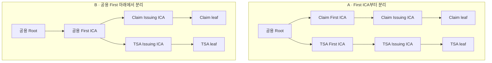

# RV-002 — 부서별 구조에 따른 ICA 용도와 사용 방식

- 작성일: 2026-09-21 KST
- 상태: 선행 결정 대기
- 관련 설계: S01, S03, S05, S06, S09
- 관련 요구사항·과제: [R05, R08, R12, D01, V02](../requirements.md)
- 문답: [Q01](../design-dialogue-log.md#q01), [검토 순서 정정](../design-dialogue-log.md#review-order)
- 선행 검토: [RV-001 — 부서별 CA 계층과 운영 책임](001-first-ica-structure.md)
- 선행 확정 결정: 아직 없음
- 연결된 확정 결정: 없음

## 이번 검토에서 정할 것

RV-001에서 정한 부서별 CA 구조와 책임을 바탕으로 각 부서가 어떤 용도의 ICA를 어떻게 사용할지 정한다. 첫 적용 사례는 Claim 서명과 TSA다. 부서 구조와 별개로 First의 용도별 분리를 먼저 확정하지 않는다.

선행 결정 전에도 필요한 용도와 외부 제약을 조사하고 대안을 기록할 수 있다. 최종 배치와 운영 방식은 적용할 부서 구조·책임의 결정 ID를 연결한 뒤 확정한다.

## 선행 검토에서 받을 내용

| 필요한 입력 | 현재 상태 |
|---|---|
| 부서별 First 또는 공용 First 구조 | RV-001에서 검토 중 |
| 중앙·부서의 키 관리와 발급·폐지·복구 책임 | RV-001에서 검토 중 |
| 부서별 독립 운영·변경·종료 경계 | RV-001에서 검토 중 |
| 신뢰 앵커와 검증 대상 또는 남은 확인 조건 | RV-001에서 검토 중 |
| 허용된 계층 깊이와 정책 제약 | 기존 제약을 확인하면서 선행 결정에 연결할 예정 |

## 용도별 검토 항목

| 항목 | 정리할 내용 |
|---|---|
| 사용 목적 | 부서가 필요한 인증서와 실제 서명 대상 |
| ICA 배치 | 선행 결정의 어느 CA 아래에 해당 용도의 ICA를 둘지 |
| 키·인증서 구분 | 용도별 전용 키, 프로파일과 허용 서명 대상 |
| 운영 흐름 | 누가 ICA를 요청·승인·발급하고 leaf 발급을 운영하는지 |
| 인계·상태 관리 | 인증서 전달·수락, 폐지 요청, 상태 제공과 사고 통보 책임 |
| 교체·종료 | 해당 용도의 키 교체·운영 중단이 다른 용도와 부서에 주는 영향 |
| 정책·검증 | C2PA 등 적용 원문, 등록 대상, 상호 운용과 거부 시험 |

여기서 검토하는 사용 방식은 Claim/TSA를 어디에 배치할지뿐 아니라 해당 ICA를 요청·운영·교체하는 흐름까지 포함한다. 기존 초안의 용도별 First 분리안(D01)은 후보 기록으로 유지한다.

## 선행 구조에 대한 피드백

용도별 프로파일·등록·검증 조건을 적용할 수 없는 문제가 드러나면 근거와 영향을 RV-001에 전달한다. 부서별 구조를 임의로 변경하거나 CA 단계를 추가하지 않고, 선행 결정을 재검토한 뒤 두 결정의 관계를 기록한다.

## 사전 검토 이력

아래는 부서별 구조 검토의 선행 관계를 정하기 전에 작성한 용도별 First 비교다. 당시 가정과 확인 사항을 보존하며, 현재의 확정 구성이나 독립적으로 선택할 최종 대안 목록으로 사용하지 않는다.

### 2026-09-21 13:07 — 최초 비교

**답변 요지 — 구조에서 도출한 설계 비교**

두 안 모두 Claim과 TSA의 Issuing CA 키는 별개다. 차이는 그 위의 First ICA를 용도별로 운영하는지, 공통으로 운영하는지에 있다. 용도별 Issuing ICA가 하나씩 있는 경우를 예로 든다.

| 비교 항목 | A: First 분리 | B: First 공용 |
|---|---|---|
| Root를 제외한 CA 키 수 | First 2개 + Issuing 2개 | First 1개 + Issuing 2개 |
| First 운영 | 생성·승인·백업·감사·교체 대상을 두 개 관리 | 한 개를 관리하되 두 용도의 발급 정책을 구분 |
| First 키 교체 | 용도별 교체 시점과 절차를 나누기 쉬움 | 공용 First에 의존하는 두 계층의 영향을 함께 검토 |
| First 서명 작업 중단 | 독립 운영한다면 해당 용도의 Issuing CA 추가·교체만 중단 | 양쪽 Issuing CA 추가·교체가 중단 |
| First 키 침해 | 용도별 신뢰 앵커·권한을 함께 분리하면 영향을 제한할 수 있음 | 공용 First를 양쪽 신뢰 근거로 쓰면 양쪽 경로에 영향 |
| 계층 깊이 | Root → First → Issuing → leaf | Root → First → Issuing → leaf |

First 서명 작업 중단만으로 기존 Issuing CA의 leaf 발급이나 이미 발급된 인증서 검증이 즉시 중단되는 것은 아니다. 인증서 폐지·신뢰 제거·발급 중단 정책은 별도로 판단한다. First 키를 두 개 둔다고 HSM도 반드시 두 개가 필요한 것은 아니며, 실제 운영 분리는 키 접근 권한·실행 환경·관리자 권한에 달려 있다.

**격리의 조건:** First의 이름만 Claim/TSA로 나누어서는 용도 간 위조 경로를 막았다고 볼 수 없다. 양쪽 검증자가 공용 Root 아래의 제한 없는 First를 모두 신뢰한다면, 침해된 First가 다른 용도의 인증서를 발급하는 경로도 검토해야 한다. 용도별 신뢰 앵커·검증 제약과 키 접근 권한을 함께 설계해야 한다. 반대로 Issuing CA를 직접 신뢰 앵커로 쓰는 경우에는 상위 First의 침해가 검증에 미치는 영향도 달라진다. 공용 Root는 두 안 모두에서 공유하는 관리·복구 의존성이다.

**공식 원문 확인**

- 기준: C2PA Certificate Policy v0.2, 공식 저장소 commit `7b2fcb3ca5f60bbd4c6dfc6ccfaccaaa5ff9fc50`; C2PA Technical Specification 2.4; RFC 5280. 이 비교는 해당 버전 기준이며 이후 버전의 적용 여부는 별도다.
- [C2PA Specification 2.4 §14.4](https://spec.c2pa.org/specifications/specifications/2.4/specs/C2PA_Specification.html#_trust_lists)는 Claim 서명자와 TSA의 신뢰 목록을 구분한다. 목록 분리만으로 First ICA 키를 반드시 분리해야 한다거나 같은 First의 양쪽 목록 등록이 허용된다고 결론 내리지 않는다.
- [First Intermediate CA 프로파일](https://github.com/c2pa-org/conformance-public/blob/7b2fcb3ca5f60bbd4c6dfc6ccfaccaaa5ff9fc50/docs/v0.2/cert-profiles/intermediateCa.cert.yaml)은 pathLen=1을 정의하며 Claim/TSA별 First를 별도로 정의하지 않는다. [Claim Issuing CA 프로파일](https://github.com/c2pa-org/conformance-public/blob/7b2fcb3ca5f60bbd4c6dfc6ccfaccaaa5ff9fc50/docs/v0.2/cert-profiles/claimSigningIssuingCA.cert.yaml)과 [TSA Issuing CA 프로파일](https://github.com/c2pa-org/conformance-public/blob/7b2fcb3ca5f60bbd4c6dfc6ccfaccaaa5ff9fc50/docs/v0.2/cert-profiles/tsaIssuingCA.cert.yaml)은 각각 pathLen=0 및 용도별 EKU를 정의한다.
- TSA Issuing CA 프로파일의 Issuer Name은 Root를 언급하고 AKI는 root/intermediate를 언급한다. First → TSA Issuing 구조의 공식 적용 해석(V02)은 두 비교안 모두에서 남는다.
- [RFC 5280 §6](https://www.rfc-editor.org/rfc/rfc5280.html#section-6)은 검증에 사용할 신뢰 앵커의 선택을 정책으로 다룬다. 위 침해 영향 비교는 계층도뿐 아니라 실제 신뢰 앵커 선택에 따른 설계 분석이다.
- 첫 안이 First에서 leaf를 직접 발급하는 뜻이라면 A는 한 단계 짧은 별도 비교가 필요하다. [CP의 Key Pair and Certificate Usage](https://github.com/c2pa-org/conformance-public/blob/7b2fcb3ca5f60bbd4c6dfc6ccfaccaaa5ff9fc50/docs/v0.2/C2PA%20Certificate%20Policy.md#key-pair-and-certificate-usage)는 Claim/TSA leaf 발급자를 pathLen=0의 하위 CA로 제한한다. Root 직하라는 위치와 pathLen=1의 First Intermediate 프로파일 역할을 구분해야 한다.

**설계 판단:** 같은 중앙 운영 조직이 두 용도를 관리하고 First 수준의 독립 교체·권한 분리가 필요하지 않다면 B가 관리할 CA 키를 줄이는 후보가 된다. First 수준부터 용도별 독립 운영·신뢰 전환이 필요하다면 A를 검토할 이유가 있다. 현재 정보만으로 A를 필수 구조로 확정하지 않는다.

**남은 결정:** A의 leaf 발급 계층, First 수준의 운영·신뢰 분리 필요성, 용도별 Trust List 등록 대상. 비교를 요청한 사용자 발언은 어느 안의 채택으로도 처리하지 않는다.

### 2026-09-21 13:53 — 선행 결정 연결

사용자 지적에 따라 이 주제를 RV-001의 후속 검토로 배치했다. 부서별 구조가 정해지면 위 사전 비교에서 어떤 내용이 해당 구조에 적용되는지 다시 평가한다. 예를 들어 부서별 First를 선택했을 때는 해당 부서 First 아래의 용도별 ICA 사용 방식을 검토하고, 공용 First를 선택했을 때는 부서·용도별 ICA의 요청·운영 방식을 검토한다.

## 결정 후 반영할 곳

- 용도별 ICA 구성·운영 방식을 확정 결정으로 기록하고 선행 부서 구조 결정과 연결한다.
- requirements.md의 D01 및 operating-model.md의 계층·발급·인계 설계에 반영한다.
- 프로파일 해석이나 구현 검증이 남으면 결정의 조건과 확인 과제로 연결한다.
