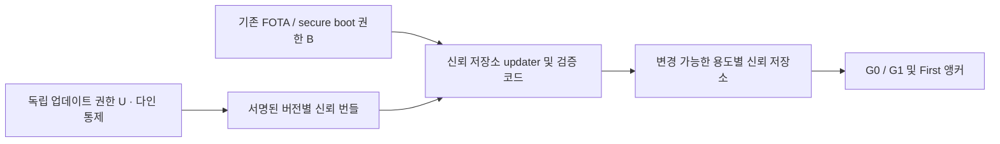

# 단말 신뢰 앵커 교체와 양자내성 전환

2026-09-16 KST 설계 초안. 기존 단말의 유일한 갱신 경로가 FOTA라는 사용자 설명을 출발점으로 한다. 실제 저장소·부팅 구조·검증기의 능력은 아직 조사하지 않았다.

## 1. 무엇을 교체하는지 구분

단말에는 Root의 **공개키 또는 인증서**가 들어간다. 중앙 Root 개인키를 단말에 배포하는 설계가 아니다.

| 대상 | 용도 | 갱신 권한/제약 |
|---|---|---|
| 플랫폼 CA 신뢰 앵커 G0 | 플랫폼 인증서 체인 검증 | 플랫폼 신뢰 저장소 정책 |
| Claim/TSA First 신뢰 앵커 | C2PA 및 TSA 신뢰 판단 | 공식 Trust List와 해당 검증기의 신뢰 정책. G0 변경과 별도 |
| 신뢰 저장소 업데이트 권한 U | 신뢰 목록의 추가·제거 승인 | G0와 독립된 키·권한으로 설계 |
| FOTA/secure boot 신뢰 키 B | 펌웨어와 부팅 코드 검증 | 기기별 FOTA·ROM·OTP·키 슬롯 정책 |

C2PA 콘텐츠를 생성하는 기기라는 이유만으로 G0를 콘텐츠 검증용 앵커로 탑재해야 하는 것은 아니다. 각 저장소에 어떤 키가 들어가고 어떤 코드가 사용하는지 먼저 목록화한다. C2PA First의 공식 등록·제거와 자체 단말 번들 배포는 서로 다른 작업이며 둘 다 필요한 경우 각각 추적한다.

## 2. 권고 구조

CA Root를 그대로 번들 서명 키로 겸용하지 않는다. [CP]의 Root 키 용도 제한과도 구분하고, G0가 침해돼도 U로 G0를 제거할 수 있도록 한다. U가 G0 아래 임의 인증서를 따라 자동으로 신뢰되거나 G0 보유자가 U를 마음대로 교체하는 구성은 이 독립성을 제공하지 않는다.

U는 기존 FOTA로 안전하게 bootstrap한 별도 업데이트 키 집합을 권고한다. 예를 들어 root 역할 2-of-3, 용도별 targets 역할의 제한된 권한으로 신뢰 번들을 배포한다. 이는 제안값이며 C2PA의 CA 키 quorum과 동일한 프로토콜이 아니다.

[TUF]의 root/targets/snapshot/timestamp 역할을 갖춘 검증된 구현을 우선 검토한다. CA 인증서 목록은 TUF의 **target 데이터**이며 TUF root metadata 자체와 다르다. TUF의 `timestamp` 역할도 RFC 3161 TSA와 다르다. 일부 아이디어만 구현한 자체 프로토콜을 TUF 준수라고 부르지 않는다.

## 3. 신뢰 번들 계약 제안

서명 대상 target에는 최소한 다음을 포함한다. 아래 필드는 이 프로젝트의 데이터 모델 제안이며 기존 표준의 필드명을 그대로 재현한 것이 아니다.

| 필드 | 목적 |
|---|---|
| schema_version, bundle_version | 파서 호환성과 변경 순서 |
| vendor, product_class, environment, trust_store_id | 다른 제품·시험 환경·다른 용도로의 오배포 방지 |
| min_updater_version, required_algorithms | 지원하지 못하는 검증 코드에서 부분 적용 방지 |
| anchors | 공개 인증서/SPKI 지문, 용도, 허용 제약, 추가/폐기 상태 |
| removed_key_ids, policy_epoch | 제거된 키의 재도입 방지. 필요한 경우 키 계열 전체를 식별 |
| activation/retirement 정책 | 배포·활성·제거 단계를 분리; 신뢰 가능한 시각이 있을 때만 시각 조건 사용 |
| payload_digest, size | 인증서 목록의 변조·잘림·과도한 크기 방지 |

서명과 메타데이터를 검증한 뒤 별도 슬롯에 저장하고 원자적으로 활성화한다. 전원 차단으로 일부 앵커만 적용되는 상태를 허용하지 않는다. 마지막 정상 상태와 최고 수락 버전/보안 epoch를 보호 저장소에 남긴다. 펌웨어를 롤백해도 이미 제거한 앵커가 다시 살아나지 않도록 저장소와 부팅 정책을 연계한다.

안티롤백은 버전 카운터로 처리하고, 업데이트를 계속 막는 freeze 공격은 메타데이터 만료 및 신뢰 가능한 시간 정책으로 별도 처리한다. 단조 카운터만으로 최신성을 증명할 수 없다. 신뢰 가능한 시간이 없는 제품에는 안전한 시간 확보/복구 절차를 정해야 하며 TUF의 만료 검사를 무조건 생략하지 않는다. [TA-MGMT], [SUIT]

## 4. 기존 단말에서 시작하는 단계

1. **현황 분류:** trust store, 인증서 pin, 검증 라이브러리, TEE/secure element 키 슬롯, secure boot/ROM 키를 각각 조사한다.
2. **첫 FOTA:** 변경 가능한 저장소·번들 updater·독립 U 공개키·안티롤백 상태를 설치한다. 현재 보안 부팅과 FOTA 검증이 아직 신뢰 가능할 때 수행한다.
3. **시험 배포:** 동작에 쓰지 않는 새 앵커를 추가하고 검증 결과·상태 버전을 수집한다. 시험 키는 운영 신뢰 범위에 넣지 않는다.
4. **독립 갱신:** 이후 일반적인 공개 앵커 추가·제거는 별도 번들로 수행한다. 파서·알고리즘·TEE·부팅 기능 변경에는 계속 FOTA 또는 제조사 업데이트가 필요하다.
5. **미지원 단말:** updater를 넣을 수 없으면 FOTA로 계속 갱신한다. ROM/OTP에 고정된 단일 키가 부팅의 유일한 근거이고 대체 슬롯·위임 경로가 없다면, 원격 소프트웨어만으로 그 하드웨어 신뢰 근거를 교체할 수 있다고 약속하지 않는다.

패키지 전달은 Global/CN 저장소·CDN·오프라인 반입 등으로 할 수 있다. 무결성과 권한 판단은 전달 경로만 믿지 않고 서명된 메타데이터로 수행한다. 장기 미접속 단말이 건너뛴 갱신을 따라올 수 있도록 필요한 중간 metadata를 보존한다.

## 5. 정상 키 교체

정상적인 G0→G1 교체는 아래 순서로 진행한다.

CA·Subscriber·응답자 인증서의 교체에는 [새 키로 발급하는 절차](operating-model.md#rekey)를 적용한다. 같은 키의 인증서 만료일만 연장하는 방식을 사용하지 않는다. 구 계층을 중단해도 [기록 보존](operating-model.md#records)과 [OCSP 제공](operating-model.md#ocsp) 의무는 남으므로 상태 서비스의 유지·이관을 교체 계획에 포함한다. 아래 단계에서 기존 인증서를 새 키로 교체해야 하는 대상과 계속 검증만 지원할 대상을 구분한다.

1. 새 G1·First 키를 생성하고, G1이 필요한 저장소와 First 등록 대상 목록을 정한다.
2. U가 승인한 번들로 새 공개 앵커를 **먼저 추가**한다. 기존 G0 경로를 즉시 지우지 않는다.
3. 제품별 수락 상태와 검증 호환성을 확인한다. 새 First는 필요한 공식 목록 등록·배포가 완료된 뒤 사용한다.
4. 신규 발급을 새 계층으로 전환하고 기존 인증서·오프라인 단말·서비스 인계 상황을 추적한다.
5. 구 계층의 신규 발급을 중단한다. 기존 콘텐츠 검증에 필요한 체인·타임스탬프·상태 증빙과 당시 정책을 보존하되, 현재 신뢰 제거가 과거 검증 결과에 주는 영향은 대상 검증기로 확인한다.
6. 지원 정책상 허용한 유예 기간 뒤 U의 별도 갱신으로 구 앵커를 제거한다. 신뢰 제거와 개인키 파기는 별도 절차다.

U 자체의 정상 교체는 [TUF] §5.3/§6.1의 구/신 키 집합에 의한 정족수 검증과 순차 root metadata 갱신을 이용하는 안이다. 오랫동안 접속하지 않은 단말이 중간 버전을 건너뛰지 않고 따라갈 수 있어야 한다. 이는 업데이트 권한의 전환 규칙이며 X.509 CA Root끼리 교차서명하는 것과 다르다.

## 6. 침해 복구

- **G0만 침해:** 독립 U로 G0와 필요한 하위 앵커의 차단 정책을 배포한다. G0가 새 키를 서명했다는 사실만으로 새 키를 신뢰시키지 않는다. C2PA First가 독립 신뢰 앵커라면 G0 제거만으로 First가 자동 제거되지 않으므로 영향 판단에 따라 별도로 조치한다.
- **일부 U 키 침해:** 남은 정족수가 안전하고 공격자가 정족수를 확보하지 못한 경우 업데이트 키 교체 절차를 적용한다.
- **U 정족수 침해/전부 분실:** 손상된 U가 서명한 새 목록만으로 복구하지 않는다. 독립적으로 보호된 FOTA/복구 권한 또는 사전에 설치한 별도 복구 경로가 필요하다. 새 키의 자체 서명은 공격자의 키도 만들 수 있으므로 신뢰 증명이 아니다.
- **B와 U가 모두 깨짐:** 사전에 마련한 다른 신뢰 근거가 없으면 원격 복구 보장을 하지 않는다. 기기 회수·제조사 물리 복구·지원 종료 중 가능한 경로를 제품별로 정한다.

이 복구 경계를 포함한 신뢰 앵커 관리는 [TA-MGMT] §3.11과 [NIST-KM] §5.6의 문제 설정을 참고한 프로젝트 설계다.

## 7. 양자내성 전환

PQC는 공개 Root 파일만 교체하는 작업이 아니다. 최소 네 영역의 전환이 필요하다.

| 영역 | 확인할 것 |
|---|---|
| CA/HSM | 새 서명 알고리즘·모듈·인증 상태·quorum·백업·성능 |
| C2PA 생태계 | 인증서/COSE/타임스탬프 프로파일, 공식 신뢰 목록 등록과 외부 검증기 지원 |
| 단말 | X.509/SPKI/서명 파서, 검증 라이브러리, 메모리·저장소·TEE 지원 |
| 업데이트/부팅 | U와 B의 알고리즘, ROM 제약, 새 검증 코드를 도입할 안전한 경로 |

[FIPS204]는 ML-DSA 표준이며, 확인일의 [AWS-MECHANISMS]에는 PKCS#11 ML-DSA 지원이 기재돼 있다. 그러나 이것은 선택한 HSM/SDK의 FIPS 적합성, CLI quorum 또는 C2PA 수용성을 함께 증명하지 않는다. 검토한 CP v0.2의 CA 프로파일은 RSA/EC를 명시하므로 ML-DSA 인증서를 현재 C2PA용으로 바로 채택하지 않는다.

### 단계적 전환안

1. **지금:** 알고리즘 식별자·가변 길이 키/서명을 수용할 저장 형식, 복수 앵커, 버전 정책, 실제 저장 위치 목록을 준비한다. 현재 알고리즘이 안전할 때 updater와 새 검증 코드를 배포할 수 있게 한다.
2. **지원 확보:** 신규 HSM·CA·단말 검증기를 시험하고 새 알고리즘 verifier를 먼저 배포한다. PQC CA 키뿐 아니라 업데이트 권한 U와 부팅 경로 B도 점검한다.
3. **상호 운용 기간:** 기존 제품과 전환 제품을 명시적으로 구분해 기존 계층과 PQC 계층을 병행한다. 한쪽 서명만 맞으면 되는 OR fallback을 PQC 보장으로 설명하지 않는다. 결합 서명이 필요하면 명시적으로 지원되는 형식·검증 정책에서 두 검증의 AND 조건을 검증한다.
4. **새 체계 활성화:** 지원·신뢰 배포가 완료된 제품부터 새 발급으로 전환한다. 미지원 제품의 경로와 종료 시점을 별도 관리한다.
5. **구 알고리즘 종료:** 복호화/서명 위조 위험이 현실화되기 전에 전환을 마친다. 기존 알고리즘이 이미 깨진 뒤 그 알고리즘으로 서명한 FOTA·새 Root·시간 증빙만으로 안전한 전환을 보장할 수 없다.

PQC Root에 고전 서명으로 교차서명해도 고전 검증 경로의 양자내성은 생기지 않는다. 새 인증서를 추가해도 기존 단말이 미지원 알고리즘을 검증할 수 있게 되는 것은 아니다. 기존 콘텐츠의 고전 서명도 소급하여 PQC 서명으로 바뀌지 않는다.

## 8. 단말 검증 시나리오

정상 추가→발급 전환→제거, 잘못된 제품/환경 번들, 변조·알 수 없는 알고리즘, 구 버전 replay, 만료 metadata, 장기 미접속, 순차 U 교체, 전원 차단, 펌웨어 rollback, G0 침해, U 정족수 침해를 시험한다. 새 알고리즘 미지원 시 부분 적용하거나 보안 수준을 조용히 낮추지 않아야 한다. 저장소별 적용 버전·키 지문·오류를 수집하되 Root 개인키 등 비밀은 수집하지 않는다.

구현 전 조사할 핵심 항목은 실제 저장 위치와 보호 수준, 현재 업데이트 서명 권한, 제품별 지원 수명, 장기 오프라인 허용 기간이다. 미정값은 설계를 멈추는 이유로 삼지 않고 제품별 적용 표에 채운다.

[CP]: https://github.com/c2pa-org/conformance-public/blob/7b2fcb3ca5f60bbd4c6dfc6ccfaccaaa5ff9fc50/docs/v0.2/C2PA%20Certificate%20Policy.md
[TUF]: https://theupdateframework.github.io/specification/latest/
[TA-MGMT]: https://www.rfc-editor.org/rfc/rfc6024.html
[SUIT]: https://www.rfc-editor.org/rfc/rfc9124.html
[NIST-KM]: https://nvlpubs.nist.gov/nistpubs/SpecialPublications/NIST.SP.800-57pt1r5.pdf
[FIPS204]: https://csrc.nist.gov/pubs/fips/204/final
[AWS-MECHANISMS]: https://docs.aws.amazon.com/cloudhsm/latest/userguide/pkcs11-mechanisms.html
